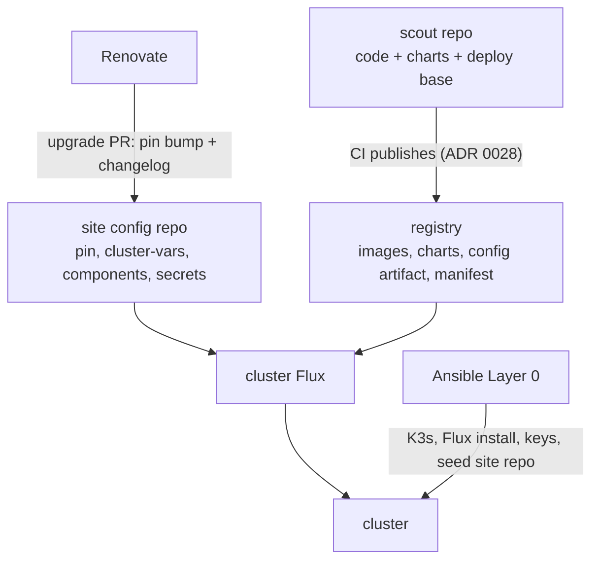
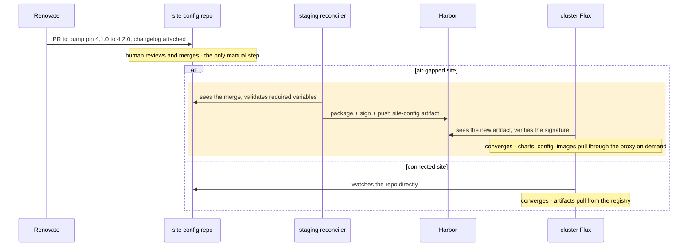

# ADR 0029: GitOps Deployment Base; Ansible Reduced to Bootstrap

**Date**: 2026-07-09
**Status**: Proposed
**Decision Owner**: TAG Team

## Summary

- Scout ships its deployment definition as a `deploy/` directory in this
  repository: a Kustomize base per component, consumed by Flux. CI
  publishes it as a versioned **deployment-config artifact** with chart and
  image references stamped in from the build manifest (ADR 0028). A cluster
  is pinned to exactly one version of that artifact.
- **Upgrades are pull requests** to a small per-site configuration repo.
  Renovate proposes the version bump with the changelog attached; a human
  merges; `git revert` rolls back.
- **Secrets live SOPS-encrypted in the site repo** by default — rotating
  one is a PR. Cloud estates instead pull from an external secrets manager
  (External Secrets Operator, e.g. AWS Secrets Manager); sites whose policy
  forbids secrets in git keep the current Ansible/vault path for secret
  material only.
- **Air-gapped sites**: every Scout air gap today is "soft" — the cluster
  has no internet access but reaches a staging node with outbound access.
  The cluster watches one signed artifact in the staging registry (its
  packaged site configuration) and pulls everything else through the
  proxy cache it already uses. Tooling for fully disconnected sites is
  discussed but deferred until one exists.
- **Ansible shrinks to node bootstrap**: K3s, registries, CA trust, GPU,
  staging services, installing Flux, generating the cluster's secrets key,
  and seeding the site repo once. The `make install-<service>` targets are
  removed at cutover.

## Context

Scout is deployed by running Ansible from a jump node: a one-shot push,
not continuous reconciliation. A playbook run applies configuration once
and then nothing watches the cluster, so a manual hotfix or a half-finished
run leaves state that nothing detects or corrects. The model also
concentrates knowledge and hides intent — inventory is reviewed and merged,
but the change that actually lands is a human privately running playbooks
from their own machine, with no cluster-visible record. GitOps inverts
this: the cluster continuously pulls toward a state declared in git,
changes are reviewed before they apply, drift is detected and corrected,
every upgrade is a PR in the history, and alerting raises exceptions back
to humans. That operational gap alone is reason to move; two sharper
problems make it pressing.

The first is duplication. Scout's deployment is defined twice: the Ansible
roles in this repository are canonical and serve the on-prem sites, while
clusters managed with GitOps re-implement the same deployment in their own
repositories, hand-porting values, ConfigMaps, and config templates out of
the roles. This is not a matter of discipline — beyond installing charts,
the roles imperatively create Secrets and ConfigMaps, run one-off Jobs, and
sequence components, work with no declarative form to hand a GitOps engine.
A consumer has to re-express all of it and then keep the re-expression in
sync by hand, and every hand-ported file drifts silently from its source.
`docs/internal/gitops-transition-analysis.md` catalogs the full surface —
secrets, ConfigMaps, operator resources, one-off Jobs, computed
configuration, file bundling, deployment ordering — and maps each to a
GitOps equivalent.

The Spark 4 incident showed what that drift costs: the new engine's
required spark-defaults changes shipped in this repository's Ansible
template while a GitOps cluster carried a stale hand-copy and received the
new engine image without the configuration it needed. That specific
incident is covered by two narrower fixes — chart-owned configuration
(Section 4, shipped first) keeps the config from going stale, and
ADR 0028's manifest ties image and configuration versions together — so it
is not, by itself, what justifies the base. The base is for everything the
incident is only an instance of: ordering, Jobs, feature-flag composition,
file bundling.

The second problem is adoption. The Ansible-only install is a barrier: a
site already running Kubernetes, Flux, and Harbor cannot take Scout without
also standing up an Ansible control node — SSH, inventory, vault — that it
has no other reason to run. GitOps is the idiomatic, Kubernetes-native way
to operate a cluster, so a team that runs one already speaks it. Today
Scout can be installed, but not simply consumed.

### Requirements

- One shared deployment core, defined in this repository. For K3s sites
  (Traefik + oauth2-proxy edge, per ADR 0003/0012) the base is the
  complete definition of how Scout deploys.
- Cloud deployments share the core — the data plane, the applications, the
  charts — and replace the edge: ingress and auth, the secrets backend,
  storage classes, possibly managed database/cache services. Replacing the
  auth edge is design work, not a values swap: auth terminated at a load
  balancer changes session and logout behavior in ways the applications
  see.
- A deployment that already runs its own GitOps repo can either adopt this
  base as its upstream, or keep its own tree and consume only the
  published charts. Both are supported; the drift-elimination claim holds
  only for adopters, and adopting the base is the intended end state.
- On-prem and air-gapped sites stay fully supported. Node-level bootstrap
  cannot be expressed as cluster manifests, so some Ansible remains.
- Feature flags (`enable_chat`, `enable_xnat`, playbooks, GPU) stay
  first-class, and both ADR 0028 lanes are consumable: dev clusters track
  builds, production sites pin releases.

### Out of scope

Environment promotion, deployment gates, canary/progressive delivery
(future ADR). Versioning and artifact publishing is ADR 0028.

## Decision



### 1. A `deploy/` base, published as one pinnable artifact

- One Kustomize base per component (lake, analytics, orchestrator,
  extractor, monitoring, launchpad, auth, …) holds the component's
  HelmRelease, its raw manifests (operator resources, Traefik
  middlewares), and `configMapGenerator` entries where Ansible used to
  bundle files dynamically.
- HelmReleases reference the published OCI charts (ADR 0028) — never a
  chart from a git branch.
- CI publishes the base as a deployment-config OCI artifact on both
  lanes. At publish time, chart versions and image references are stamped
  in from the build manifest as `name:tag@digest` — digests for machines,
  producing-build tags for humans. In git the references are placeholders,
  so nothing in the tree changes per merge.
- A cluster is pinned by exactly one reference: the tag of its
  `OCIRepository` for this artifact. (A version substitution variable was
  considered and rejected — it is a second pin that must be kept in
  agreement with the first.)
- The playbook ordering becomes a Flux dependency graph: one
  `Kustomization` per layer, `dependsOn` edges, and health checks
  (including CEL `healthCheckExprs` on operator resources) instead of
  Ansible wait loops.
- Feature flags become Kustomize Components: a site's overlay includes
  `chat`, `xnat`, `playbooks`, `gpu` or it doesn't. A component carries
  everything its flag used to conditionally create, including its Keycloak
  client configuration.

### 2. One-off operations become Jobs with dependencies

Initial database creation moves into the CloudNativePG bootstrap
(`postInitApplicationSQL`). Databases added later, MinIO IAM setup,
Temporal schedules, and model pulls become idempotent Jobs in their own
`Kustomization`, ordered with `dependsOn`. The keycloak-config-cli realm
import is already a Helm-hooked Job and doesn't change.

### 3. Secrets: fixed names in the base; SOPS in git by default, external secrets manager on cloud, vault as fallback

The base references Secrets by fixed name only. They materialize one of
three ways:

- **Default for on-prem, from cutover: SOPS-encrypted Secrets committed to
  the site repo**, decrypted natively by Flux's kustomize-controller. The
  `.sops.yaml` recipients are the cluster's age key and a site operations
  key, so operators can edit files and the cluster can decrypt them.
  Rotating a secret is a PR like any other change. What remains for
  Ansible: generate the cluster key at bootstrap, keep a recovery copy in
  the Ansible vault (one escrowed secret instead of fifty managed ones),
  and run the one-time vault-to-SOPS migration when the site repo is
  seeded. Dev clusters adopt this first (implementation plan, phase 4) and
  prove it for a full phase before any on-prem site depends on it.
- **Cloud**: External Secrets Operator or equivalent, unchanged.
- **Fallback**: some hospital environments prohibit secrets in git,
  encrypted or not — a policy Scout doesn't get to overrule. Those sites
  keep the current Ansible/vault materialization for secret material only.
  They are the one place two owners persist, with a bright line: Flux owns
  configuration, Ansible owns secret material and nodes, and no resource
  is writable by both.

Key custody: a committed encrypted secret is in git history forever, so a
leaked cluster key exposes that history retroactively. Site repos are
private regardless (Section 6). Key rotation is `sops updatekeys` plus
re-encryption, with the escrowed copy replaced the same way it was
created.

### 4. Derived configuration moves into charts; what's left goes in one ConfigMap

- **Into the charts**: charts accept a small set of inputs — `domain`, the
  ADR 0011 service-mode values — and derive the rest in `_helpers.tpl`.
  `spark-defaults.conf`, the file at the center of the motivating
  incident, becomes chart-owned and mode-switched, and ships first (plan,
  phase 0). The fix reaches a site only through published charts; a
  chart-owned file consumed from today's frozen git-sourced charts would
  freeze just the same.
- **Remaining scalar settings** live in one `cluster-vars` ConfigMap in
  the site repo, applied with Flux's `postBuild.substituteFrom`. Ansible
  seeds it once from `inventory.yaml` at bootstrap and never writes it
  again. Two guardrails keep substitution failures loud: Flux runs with
  `StrictPostBuildSubstitutions`, so an undefined variable fails the build
  instead of becoming an empty string, and the config artifact carries a
  required-variables list that the site repo's CI checks before a version
  bump merges. Details in Appendix B.
- **Structured settings** — maps and lists such as
  `trino_attribute_filters` (ADR 0020/0025), dashboard bundle selections,
  multi-disk storage-class maps — don't fit string substitution and aren't
  forced into it. They live in the site overlay as values files and
  patches. Shared maps keep ADR 0020's one-edit promise through
  `valuesFrom`: `trino_attribute_filters` is one key in one ConfigMap,
  read by every HelmRelease that renders from it.
- **The Keycloak realm** stops being one Ansible-templated document. It
  decomposes into keycloak-config-cli fragments: a base realm plus
  per-component client fragments owned by the components that need them
  (chat, xnat), with user-profile attributes rendered from the shared
  filter map. This is real design work touching ADRs 0003/0020/0025, not
  a mechanical move.

### 5. What Ansible still does (Layer 0)

K3s and node configuration, registry mirrors and CA trust, the GPU
runtime, and the staging node's services (Harbor, Nexus, Squid) — plus
installing Flux, generating and escrowing the cluster's SOPS key (or
ongoing secret materialization on vault-fallback sites), and seeding the
site repo once. Ansible stops deploying Scout services; the
`make install-<service>` targets are removed at cutover (plan, phase 5).

### 6. Operating a site: upgrades are pull requests

Each deployment gets a small **site configuration repository** holding the
version pin (the `OCIRepository` tag — the cluster's single pin),
`cluster-vars`, the enabled components, and by default the SOPS-encrypted
secrets. Flux on the cluster watches it. An upgrade is:

1. **Renovate opens a PR** bumping the pin when a release publishes, with
   the changelog in the PR body. (Renovate's flux manager updates
   `OCIRepository` tags natively; the capability is recent, so site-repo
   setup pins a minimum Renovate version.)
2. **A human reads the upgrade notes and merges.** Sites that want a
   second approver configure required reviews. Pins are exact versions — a
   cluster upgrades because someone merged, never because a registry grew
   a tag.
3. **The cluster converges** through the dependency graph.

Rollback is `git revert` — for declarative state. Reverting a pin does not
un-run a database migration, a Delta schema change, or a Keycloak realm
mutation. Releases containing such changes are marked `!` under ADR 0028's
operator contract and ship a backout procedure, and state-changing
upgrades are written so the previous version still works against the new
state (expand first, contract in a later release).

There is no parallel imperative upgrade path — not for configuration
anywhere, and not for secrets on SOPS sites. Vault-fallback sites keep an
imperative path for secret material only. The upgrade record is PR
history, not state on a jump node.

**Emergency changes.** Flux reverts manual edits by design, so incident
response needs a sanctioned way to make one stick: any on-call operator
can `flux suspend` the affected `Kustomization` (or the root) and patch by
hand. The contract is the way back: before resuming, commit the fix — to
the site repo if it's site config, upstream if it's base — so that resume
reasserts git state as a no-op. An alert fires when anything stays
suspended past a threshold, so the escape hatch can't quietly become the
operating mode. This works the same on air-gapped sites: suspending and
patching are cluster-local. Committing the fix back needs the git host
(reached through the staging proxy on-prem), so a connectivity outage can
extend the suspended window — but never delays the fix itself. The cutover
runbook ships this procedure on day one; it replaces the incident habits
the playbook era built.

**The minimum site.** One private repo on any git host. Scout can host it
for sites without one — noting that a site repo carries institutional
topology (hostnames, sizing, enabled components; never PHI), so sites with
governance constraints should keep it on their own host. Renovate is
optional (a one-line pin edit works); required review is site policy. Not
optional: the pin lives in git, and changes to it are commits.

### 7. Air-gapped sites: the cluster watches one artifact; the proxy handles the rest

Every air-gapped Scout site today is a **soft gap**: the cluster has no
internet access but reaches a staging node whose Harbor registry proxies
upstream registries (ADRs 0001/0002/0016/0017). This section designs for
that fleet. Fully disconnected sites ("hard gaps") have no current or
committed example; that work is deferred — see the end of this section.

- **The cluster watches exactly one thing: its site-config artifact.** A
  small reconciler on the staging node watches the site repo (which lives
  on the connected side), validates the required variables, packages the
  overlay — pin, cluster-vars, component selection — signs it, and pushes
  it to a hosted project in the staging registry (proxy-cache projects
  don't accept pushes). The cluster's Flux has one `OCIRepository`
  pointing at it. Routine configuration changes cross the gap the same way
  an upgrade does: merge and wait.
- **Everything else pulls on demand, but images and charts take different
  paths.** Container images ride the containerd registry mirror the
  air-gapped nodes already run (ADR 0002/0016): pod specs keep their
  `ghcr.io` references and containerd rewrites the host to Harbor
  transparently. Charts and the deployment-config artifact are fetched by
  Flux's source-controller, which runs as a pod and does not consult the
  containerd mirror — so their references must name Harbor explicitly. An
  `oci_registry` site variable (default `ghcr.io`, the Harbor proxy path
  for air-gapped sites) is substituted into those references via
  `postBuild`, ahead of the pinned digest, so only the host varies per
  site — the digest, and ADR 0028's roll-only-on-change property, stay put.
  Harbor's proxy cache does serve OCI Helm charts (confirmed by Harbor
  maintainers, though not in Harbor's own docs; the Flux config-artifact
  media type gets a one-time check in CI).
- **No completeness gate**: a cache miss behaves exactly like today, a
  fetch at pull time — never a broken upgrade. The ADR 0028 release
  manifest doubles as an optional warm-up list (pull a release's artifacts
  into the cache before the upgrade window) and as the audit record of what
  a release contains.
- **Two signing keys.** Scout's CI signs Scout artifacts; the staging
  reconciler signs the site-config artifact with its own key, provisioned
  at bootstrap on the staging node — already the site's trust conduit
  (ADR 0016). The cluster holds both public keys, and Flux refuses
  unverified sources (`spec.verify`).
- **Site-config tags**: each push is tagged with the site-repo commit it
  packages, plus a `current` pointer the cluster watches. A moving pointer
  is safe here, unlike `latest`: the content is digest-addressed and
  signature-verified, and ordering lives in the site repo's git history
  rather than in the tag stream.
- **Rollback**: proxy-cache retention plus warmed-up releases keep the
  previous release's artifacts available locally, so reverting a pin
  re-converges without refetching from upstream in the common case.

**Deferred: hard-gap transport.** If a fully disconnected deployment is
ever committed, the deferred design is: manifest-driven copying with a
completeness gate that pushes the site-config artifact last (so a cluster
can never start an upgrade its registry can't finish), the
bill-of-materials enforcement checks in Appendix B, and an archive
export/import path. Tooling evaluation (July 2026): prefer `oras copy`
(mature, general); flux-mirror (Flux-official and handles Flux media types
natively, but about two months old at v0.8.x) and Hauler (archive-based,
v2.x) are the candidates; Zarf was rejected as a full package manager
overlapping Flux and Harbor. None of this changes the site-config artifact
contract above.



This adds one small workload to the staging node and nothing to the
cluster beyond Flux itself.

### 8. Toolkit: Flux

Flux over Argo CD: native SOPS decryption, OCI artifacts as first-class
sources (what Section 7 relies on), first-class Helm hook handling, a
lighter footprint for on-prem sites, and explicit `dependsOn` ordering.
Argo's old health-check advantage is gone since Flux 2.5's CEL health
checks. Argo has been adding OCI support, so if this decision is ever
revisited, weigh the durable differences (SOPS, footprint, ordering)
rather than the OCI gap.

Portability, stated plainly: the base's leaves are Flux resources
(`HelmRelease`, `Kustomization`) and its variables assume Flux's
substitution, so consuming the base means running Flux. The portable
surface is the charts, which are plain Helm. The reference-stamping step
also matters outside CI: anyone deploying from a git checkout (local
development included) runs it to resolve the placeholder references.

### 9. Migration shape

Sequencing and work items live in
`docs/internal/gitops-implementation-plan.md`. The decisions:

- **Cut over; don't co-manage.** A long component-by-component migration
  leaves two owners per cluster for months — itself a drift surface, with
  ambiguous incident responsibility. The risk a gradual migration would
  hedge is covered by proving the whole base in CI and cutting dev
  clusters over first.
- **CI proves the base before any cutover**: deploy-and-test switches to
  the Flux path, and the deploy matrix expands to the optional components
  (XNAT, playbooks, data generator, chat in CPU mode). GPU profiles can't
  run in CI and stay dev-cluster-proven; the cutover runbook states proof
  status per component. The expanded matrix costs roughly half again
  today's deploy-and-test compute, provisioned before a cutover date is
  set. The Ansible deploy-and-test job stays, gated on `ansible/**`
  changes, until the service roles are removed.
- **The staging reconciler gets its own CI harness** (packaging,
  validation, signature verification) before it gatekeeps any production
  upgrade.
- **Dev clusters cut over first, wholesale**; on-prem sites cut over at
  their next scheduled release.
- **Existing installs are adopted, not reinstalled**: HelmReleases reuse
  current Helm release names so Helm upgrades in place, and
  Ansible-created resources get ownership relabeling (the Superset
  `dashboard-config` migration is the precedent). One adoption pass per
  cluster.

## Alternatives considered

### Migrate component by component

Ansible and Flux co-manage each cluster for months. The hybrid state is
itself a drift surface: two owners, ambiguous incident responsibility,
every change reasoned about twice. See Section 9 for what covers the risk
instead.

### Status quo: Ansible canonical, GitOps clusters re-implement

The drift machine this ADR dismantles; every feature pays a second, silent
porting cost.

### Ship versioned charts only

ADR 0028 alone. Better than today, and supported indefinitely as a
consumption mode — but the ordering, Jobs, flag composition, and derived
configuration stay duplicated per deployment.

### Argo CD as the shipped toolkit

Viable; Section 8 has the comparison.

### One umbrella Helm chart instead of Kustomize bases

Attractive as a single versioned unit, but Helm has no ordering across
releases (the dependency graph flattens), per-feature composition gets
awkward, and site overlays are limited to values where some sites need
manifest-level patches.

### Build hard-gap transport now

No fully disconnected site exists or is committed. The design and tooling
evaluation are preserved in Section 7 and activate on a real requirement.

### A repo per environment with copied manifests

Today's downstream pattern, generalized. The copies are the failure mode,
not the design.

## Consequences

### Positive

- One definition of how Scout deploys, complete for K3s sites; site
  differences become reviewable overlay diffs. Hand-ported-config drift is
  eliminated for sites on the base, and shrunk to the edge seam for sites
  consuming only the charts.
- On-prem gains continuous reconciliation, drift detection, and
  self-healing.
- Upgrades — including routine config changes on air-gapped sites — are
  reviewed, revertable PRs.
- CI exercises the same deployment path every site runs.
- On air-gapped sites a missing artifact degrades to today's lazy fetch,
  never a broken upgrade.

### Negative / accepted

- On-prem operators learn Flux, and routine work becomes git review
  instead of playbook runs. Small sites take on a git repo (see "the
  minimum site"); air-gapped sites also run the staging reconciler and a
  registry retention policy.
- Scout owns custom tooling: the ADR 0028 publish pipeline, the
  reference-stamping step, and the staging reconciler. Each has failure
  modes that are ours to debug.
- SOPS custody costs: the cluster key is a new critical secret, a leak
  exposes committed history retroactively, and rotation means
  re-encrypting the repo. Vault-fallback sites run two workflows — git for
  configuration, Ansible for secrets.
- Configuration passes through more layers (inventory → cluster-vars →
  substitution → chart values), mitigated by deriving most of it inside
  the charts.
- The migration is a concentrated effort, and each cluster's cutover is a
  scheduled event.
- Flux becomes a runtime dependency of every Scout deployment.

## Related

- ADR 0028 (two-lane versioning) — the artifacts this base pins.
- ADR 0001/0002 (air-gapped Helm/K3s), 0016 (staging CA), 0017 (package
  proxy) — the staging-node architecture Section 7 extends.
- ADR 0003/0012 (the edge auth/security posture the base's auth component
  encodes), ADR 0011 (service-mode variables).
- `docs/internal/gitops-transition-analysis.md` — the operation inventory
  and Flux/Argo comparison behind this decision.

## Appendix B: implementation notes

**Substitution scoping.** `postBuild.substituteFrom` applies only to the
`Kustomization`s that declare it. Manifests full of literal `$` — Grafana
dashboard JSON, shell scripts inside ConfigMaps — are grouped under
Kustomizations that don't substitute, rather than escaping every
occurrence. kustomize-controller runs with
`--feature-gates=StrictPostBuildSubstitutions=true` so an undefined
variable fails the build loudly; the flag is set explicitly rather than
trusting upstream defaults, and the deployed Flux version's behavior is
verified at implementation. `cluster-vars` is seeded once at bootstrap;
after that, the site repo is its only writer.

**The required-variables contract.** The config artifact carries a
`required-vars` file — variable name, description, optional validation
pattern — for the base at that version. Site-repo CI validates the site's
`cluster-vars` against the pinned artifact's list on every PR, so a
release that adds a required variable fails the Renovate bump PR with the
missing key named, before anything reaches a cluster. The staging
reconciler runs the same validation for air-gapped sites. The strict
substitution gate above is the backstop at converge time; this check is
the front door at review time.

**Bill of materials (BOM).** The BOM is the list of every third-party
image a Scout deployment pulls. It feeds the release manifest (ADR 0028),
the optional cache warm-up, and support audits. Its content ships now; the
enforcement checks described below activate only with hard-gap transport
(Section 7), the one consumer that depends on completeness outright.

- *Assembly*: render one dedicated `bom` overlay of the base — every
  optional component enabled, service modes set to the air-gapped on-prem
  profile — and extract the image references from the output. Rendered
  output is the source of truth; hand-maintained image lists drift.
- *Operator-managed images*: operand images (CNPG `imageName`, the
  K8ssandra and ECK equivalents) are always pinned explicitly in the base
  rather than left to operator-internal defaults, which never appear in
  rendered output. CI asserts at render time that every operator resource
  carries its image field.
- *Config-embedded images*: some image references live inside
  configuration rather than `image:` fields — the JupyterHub singleuser
  and profile-list images are the known cases. The `bom` overlay carries
  an explicit list of these fields.
- *The closing check*: after CI's deploy-and-test, every image the CI
  cluster actually pulled must appear in the BOM; a pulled-but-unlisted
  image fails the build.
- *GPU-only images* never appear in CI's pulled set and are covered only
  by the render-time checks. The first GPU-enabled site upgrade is their
  real verification; the cutover runbook marks them accordingly.
- *Degradation*: on a proxy-backed site, a BOM miss falls back to a lazy
  pull-through fetch — visible in the registry log, fixed by adding the
  pin. A hard-gap site would instead hit the miss at run time (a
  config-embedded image at notebook-spawn time, days after a
  healthy-looking upgrade), which is why the pulled-set check exists.

**Staging reconciler mechanics.** Scout-built artifacts go to hosted
registry projects. Upstream entries are materialized either by warming the
proxy cache (issuing a pull through the proxy project) or by mirroring
into hosted projects; a proxy-cache project cannot be pushed to. Copy
operations are idempotent and digest-verified.

**Adoption pass.** At cutover, existing installs are adopted rather than
reinstalled: HelmReleases reuse current Helm release names, and
Ansible-created resources get ownership relabeling before Flux takes over.
Budget one pass per cluster; the Superset `dashboard-config` migration is
the precedent.

**A site repo, sketched.** Exact layout is settled at implementation; the
shape is:

```
site-repo/
├── flux/
│   ├── scout.yaml          # OCIRepository (the version pin) + root Kustomization
│   └── cluster-vars.yaml   # ConfigMap consumed by substituteFrom
├── components.yaml         # which optional components this site enables
├── overlays/               # structured settings: values files, patches
│   └── trino-values.yaml   #   e.g. trino_attribute_filters
└── secrets/                # SOPS-encrypted (default posture)
    └── *.enc.yaml
```
