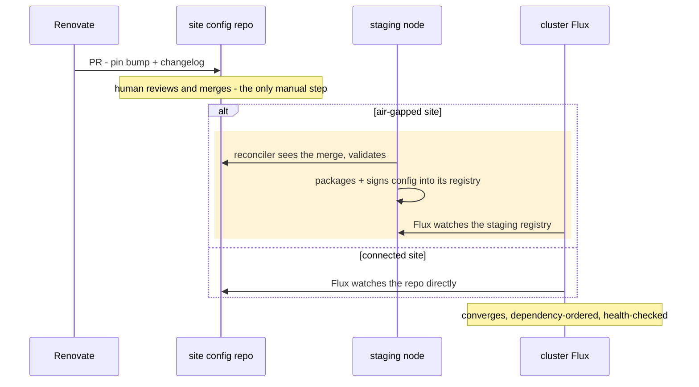

# TL;DR — Versioning & GitOps Deployment (ADRs 0030 + 0031)

One-page orientation for [ADR 0030](0030-two-lane-versioning-and-artifact-publishing.md)
(versioning and artifact publishing) and
[ADR 0031](0031-gitops-deployment-base.md) (GitOps deployment base). The
ADRs are the decision records.

## The problem

Ansible manages a cluster through one-shot pushes rather than continuous
reconciliation. A playbook run applies configuration once, from a jump node,
and then nothing watches the cluster afterward, so a manual fix or a partially
failed run leaves state that nothing detects or corrects. It also depends on
human orchestration and a fair amount of domain knowledge (or a runbook), and
it offers little cross-team transparency: inventory gets updated and merged,
but then a human privately runs playbooks from their own machine.

GitOps inverts the model. The cluster continuously pulls toward a state
declared in git, so changes are reviewed before they apply, drift is detected
and corrected, and the history of every upgrade is the PR log. Alerting closes
the loop by raising issues back to humans.

Scout isn't aligned with a GitOps model today, for two reasons:

1. Scout's deployment is defined in Ansible roles. Beyond installing charts,
   the roles imperatively create Secrets and ConfigMaps, run one-off Jobs,
   and sequence components. These operations have no declarative equivalent to hand a
   GitOps engine, so a consumer must re-express it as hand-ported manifests
   and keep them synchronized by hand.
1. Between releases, nothing has a stable identity: images ship as mutable
   `latest`, and charts are frozen at `0.0.0-dev` and never published.

Together, these mean GitOps consumers drift easily, pulling image changes
without the corresponding chart or configuration updates. When Scout upgraded
to Spark 4, for example, the HL7 transformer `:latest` image carried the
change while the Spark defaults config sat stale in a hand-copied YAML in a
GitOps repo.

Ansible is also a barrier to adoption. A site that already runs Kubernetes, Flux, and Harbor cannot adopt Scout without standing up an
Ansible control node (SSH access, inventory, vault) that they'd have no other
reason to run. GitOps is the idiomatic, Kubernetes-native way to operate a
cluster today, so a team already running one likely speaks it, while an
Ansible control node would be a separate, older toolchain to take on. 

## What we decided

**ADR 0030 — versioning.** Every merge to `main` that changes something
deployable gets a build version (`0.YYYYMMDD.<run>`). CI rebuilds only
what changed and records everything else, at its existing digest, in a
signed manifest. Thus, the manifest is the complete definition of "Scout at
that version": deployments consume `name:tag@digest` references from it,
so a pod restarts only when the code it runs actually changed. 

Releases (`X.Y.Z`) keep their meaning as deliberate, supported snapshots. The
version number and changelog are computed from Conventional Commit PR
titles, and a human decides when to merge the release PR. 

Build versions always start with `0.`, releases with `1` or higher, so no tool or person can confuse
them.

**ADR 0031 — deployment.** Scout ships its deployment as a Kustomize base
in this repo (`deploy/`), published as a versioned config artifact. A
cluster pins exactly one version of it. Each site has a small config
repo (the pin, its settings, its enabled components, its SOPS-encrypted
secrets) and upgrading means merging a PR that Renovate opens with the
changelog attached. Rollback is `git revert`. Air-gapped clusters watch
one signed artifact in their staging registry and pull everything else
through the proxy cache they already use. Ansible keeps only node
bootstrap: K3s, registries, GPU, installing Flux, generating the
cluster's secrets key, and seeding the site repo once.

## How an upgrade works

Human operator's role is to review a PR and merge it, everything else is automated.

## What ships when

Six phases, in dependency order (details:
`docs/internal/gitops-implementation-plan.md`):

0. Publish charts that change; move derived config (e.g., spark-defaults)
   into the charts. Closes the config-staleness problem.
1. Release automation: PR-title lint, release-please.
2. The build pipeline: per-merge build tags, the manifest, digest
   references. Closes the image/config coordination problem and makes
   tracking every merge safe.
3. The `deploy/` base and config artifact; CI deploys with Flux,
   optional components included.
4. Site repos, SOPS secrets, dev-cluster cutovers.
5. On-prem cutover at a scheduled release; Ansible service roles deleted.

Deferred until something needs them: releases that re-label an existing tested build instead of
rebuilding (a.k.a., "promotion"), hotfix release branches, registry pruning, and
transport for fully air-gapped sites (without pull through proxy staging node).

## What we build vs. reuse

Reused: Flux, Renovate, release-please, Harbor's pull-through proxy,
keycloak-config-cli, CloudNativePG bootstrap, SOPS/age, cosign. Built and
owned by Scout: the publish pipeline (change detection + manifest), the
reference-stamping step, the small staging packager, and the
required-variables check.
