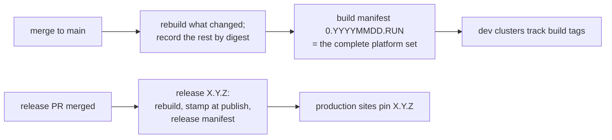

# ADR 0030: Two-Lane Versioning and Artifact Publishing

**Date**: 2026-07-09
**Status**: Proposed
**Decision Owner**: TAG Team

## Summary

- Every merge to `main` that changes something deployable gets a **build
  version** (`0.YYYYMMDD.<run>`). CI rebuilds only the components the merge
  changed and records everything else at its existing digest in a signed
  **build manifest**. The manifest is the complete, authoritative list of
  what "Scout at that version" contains.
- Deployments consume images as `name:tag@digest`, taken from the manifest.
  A pod restarts only when the content it runs actually changed.
- Releases (`X.Y.Z`) keep their current meaning: a deliberate, supported,
  documented snapshot of the whole platform. The version number and
  changelog are computed from Conventional Commit PR titles by an
  accumulating release PR; a human decides when to merge it.
- The two version families are mechanically distinguishable: `0.*` is a
  continuous build, `>= 1.0.0` is a release. Every automated consumer
  filters for one or the other.
- The source tree stops carrying versions: `latest` tags, `VERSION` files,
  and version-bump commits retire at the ADR 0031 cutover. Identity is
  stamped onto artifacts when they are built and published.

## Context

Scout is many images and Helm charts, developed in one repository and
deployed as a unit. Its versioning today has exactly two states:

- **Between releases**, every artifact carries a mutable development
  identifier. Images publish as `latest` (from `VERSION` files); ten of
  twelve charts are frozen at version `0.0.0-dev` and the other two at an
  equally frozen `0.1.0`; no chart is published as an artifact at all.
- **At release**, a manually dispatched workflow stamps a hand-chosen
  `X.Y.Z` into version files and three of the charts (`update-versions.sh`
  covers launchpad, extractor, and hive-metastore and skips the rest), tags
  the repository, publishes release images, then resets everything back to
  the development identifiers.

This works for the coordinated release but fails everyone who tracks `main`
continuously:

1. **Mutable image tags are invisible and unordered.** A deployment pinned
   to `:latest` receives whatever the last merge built, whenever a pod
   happens to restart — no record, no ordering, nothing to roll back to.
   This is how the Spark 4 incident happened: the new engine reached
   `hl7-transformer:latest` the moment it merged, ahead of the
   configuration changes it needed.
2. **Frozen chart versions never flow.** Flux only repackages a chart when
   its version changes, which between releases is never. Chart templates
   silently freeze while the images they deploy move on.
3. **Automation has nothing to select.** Flux image policies and Renovate
   need immutable, ordered tags; `latest` is neither.
4. **Releases are toil.** The version is chosen and the notes assembled by
   hand.

### Requirements

- Consumers tracking `main` get an immutable, ordered, per-merge identity
  for images *and* charts, usable by unmodified SemVer tooling.
- The coordinated release keeps meaning what it means today: a deliberate,
  supportable, documented snapshot.
- Charts become published artifacts, coupled to the images built from the
  same commit.
- Builds and releases can never be confused, by tools or by people.

### Out of scope

Environment promotion, canary/progressive delivery, and CD to
production-shaped environments (future ADR). How deployments consume these
artifacts is ADR 0031.

## Decision

|             | Build lane | Release lane |
|-------------|------------|--------------|
| Version     | `0.YYYYMMDD.<run>` | `X.Y.Z` (X ≥ 1) |
| Created     | every merge that changes deployable source | when a human merges the release PR |
| Covers      | changed images and charts (published); everything else recorded in the manifest | all artifacts, plus a repo tag and a release manifest |
| For         | clusters that track `main` | scheduled releases, air-gapped mirrors, support |
| Means       | "when it was built" — nothing more | the operator upgrade contract |

### 1. Build lane: every merge produces a complete set, described by a manifest

- Every merge that changes deployable source publishes its changed
  components at `0.YYYYMMDD.<run>`, where `<run>` is the CI run number.
  Every component the merge did *not* touch is recorded in the build
  manifest at its existing digest, together with the tag of the build that
  produced it. The manifest — a small signed document pushed to the
  registry after all the artifacts it lists — is the authoritative answer
  to "what is Scout at `0.20260708.123`". Nothing is retagged so as to avoid churn (pods rolling).
- Deployments consume `name:tag@digest` references stamped from the
  manifest (ADR 0031's config artifact does the stamping). The digest pins
  content for machines; the tag tells humans which build produced it.
  Unchanged components keep both, so a merge can never restart pods it
  didn't touch.
- Merges that touch nothing deployable (documentation, for example)
  publish no version. The decision is made from the changed file paths,
  compared against the last manifest's source commit, before anything is
  built. Changes to CI or build tooling rebuild everything, because they
  can change image contents without touching image source. Mechanics in
  Appendix A.
- The version format is SemVer-parseable so standard tooling can order it
  (it follows [ScalVer](https://github.com/veiloq/scalver), with two
  deliberate choices: the leading `0` is permanent and marks the build
  lane, and the third field is the CI run number rather than a per-date
  counter — simpler, collision-free, and ordering is dominated by the date
  anyway).
- The build version is passed into each image as a build argument (UI
  footers, package metadata), so a running image can report which build
  produced it.
- Image builds already fail CI on error. Trivy image scans are handled by
  lane: a failed or missing scan **blocks a release** but only **alerts**
  on the build lane. A scan flake or a fresh CVE never freezes day-to-day
  publishing, and unscanned bits never reach a release. (This retires the
  allow-failure CI flags, which gated the scans of three images, not their
  builds.)
- Until the ADR 0031 cutover, `latest` continues to publish alongside
  build tags for the Ansible-based deployments (Section 5).

### 2. Charts become published artifacts, coupled to their images

- CI packages a chart when files in its directory changed (any directory
  under `helm/` with a `Chart.yaml`, excluding vendored `charts/`
  subdirectories) and publishes it to `oci://ghcr.io/washu-tag/charts/<name>`.
  Unchanged charts are recorded in the manifest at their existing version,
  like images.
- A published chart gets `version` = the tag of the build publishing it,
  and `appVersion` = the tag of the build that produced the chart's
  primary image, read from the manifest. Both are set by `helm package` at
  packaging time; the `Chart.yaml` in the tree keeps a placeholder that is
  never published, and no commit ever edits it.
- Charts that deploy Scout-built images default their image tag to
  `.Chart.AppVersion`. Because `appVersion` names the image's actual
  producing build, that tag always exists in the registry — even when the
  chart and the image last changed in different builds. Chart and image
  move as one unit.
- Charts that wrap third-party images (loki, orthanc, dcm4chee,
  keycloak-config-cli) keep explicit image references; their `appVersion`
  carries no coupling meaning.
- Scout-built images that deploy through upstream charts (the
  xnat-plugin-installer under the XNAT chart, keycloak via its operator
  resource) are referenced in the deployment base's values and stamped
  when the config artifact is stamped (ADR 0031) — the same mechanism at
  the same moment, so they cannot drift separately.
- Chart publishing ships first, in phase 0 of the implementation plan,
  as a plain per-chart path filter with no manifest. Even that minimal job
  packages only charts that changed: chart versions end up in pod-template
  labels (`helm.sh/chart`), so packaging every chart on every merge would
  restart pods for no reason. Consumers pin exact chart versions and
  Renovate bumps them. The `appVersion` coupling attaches in phase 2,
  when the manifest exists; phase 0 charts publish without it.

### 3. Release lane: same meaning, automated mechanics

The coordinated release keeps its current meaning — everything ships
together under one version number. Three changes:

- **The version and changelog are computed; the timing stays human.** An
  accumulating release PR (release-please or equivalent) reads the
  Conventional Commits since the last release: `fix:` → patch, `feat:` →
  minor, `!` → major; the highest change wins, and multiple changes of the
  same kind don't stack. Merging the PR is the release. Nothing releases
  on ordinary merges.
- **Charts publish as OCI artifacts at `X.Y.Z`**, at the same registry
  paths as the build lane.
- **A release manifest publishes** (`manifests/scout:X.Y.Z`), listing
  every artifact in the release by digest: Scout images and charts, the
  deployment-config artifact, the third-party images the deployment pulls
  (the bill of materials, assembled per ADR 0031 Appendix B), and the
  signature artifacts themselves. It answers "is this registry complete
  for 4.2.0?" with a digest comparison, and a copy is attached to the
  GitHub Release so release history never lives only in a registry.

Releases rebuild everything from the release-PR merge commit, with
versions stamped at publish time. The current stamp-then-reset commit
choreography and `update-versions.sh` disappear at the ADR 0031 cutover —
they exist only because Ansible reads stamped tags out of release
checkouts, and the cutover removes that consumer. A leaner mode, where a
release re-labels an existing already-tested build instead of rebuilding,
is specified under Deferred work below.

### 4. The commit type is a message to operators

The Conventional Commit type in a PR title tells operators what an upgrade
demands, not just what the changelog says:

- `!` (or `BREAKING CHANGE`): upgrading requires operator action — a
  migration, a new inventory variable, a manual step — or is destructive.
- `feat:`: new capability or flag; safe to upgrade without action.
- `fix:`, `chore:`, `docs:`, `ci:`: safe patch or no release impact.

Enforcement: squash merges make the PR title the commit message, so a
PR-title lint (commitlint with the Conventional Commits config) enforces
the format, and a companion check requires an "Upgrade notes" section in
the description of any `!` PR. **Squash must become the repository's only
enabled merge method** (rebase merges are currently also enabled); that
settings change lands with the lint, which otherwise guards nothing.

Limits, accepted: a PR mixing a feature with a breaking change must be
split or titled `!`, which files the feature under the major. The whole
signal rests on title discipline — one mistitled `fix:` incorrectly tells
operators "safe." ADR 0031's required-variables check catches the breaking
changes that add a variable; behavioral breaks that don't are caught only
by review. The version number stays a summary: breaking releases ship
upgrade notes, and deprecations are announced before the major that
executes them.

### 5. Rules for consumers

Three kinds of tags will exist, and every automated consumer must select
exactly one:

| Kind    | Pattern             | Selected by |
|---------|---------------------|-------------|
| build   | `0.YYYYMMDD.<run>`  | Flux `filterTags` pattern `'^0\.\d{8}\.\d+$'` |
| release | `X.Y.Z`, X ≥ 1      | SemVer range `>= 1.0.0` |
| release candidate | `X.Y.Z-rc.<run>` | explicit pattern, opt-in only (Deferred work) |

An unfiltered SemVer policy is a bug: release tags sort above build tags
and always win. SemVer ranges exclude prerelease tags by default, which is
what keeps future release-candidate tags away from stable consumers.
Renovate applies the same split with `allowedVersions` or regex
versioning.

Retired at the ADR 0031 cutover:

- `latest` and the other mutable tags stop publishing; the build lane
  replaces every remaining consumer.
- `VERSION` files and the `derive-version` tooling are deleted. Version
  fields that files must syntactically carry (`Chart.yaml`,
  `pyproject.toml`) stay as inert placeholders that never reach a
  published artifact — CI asserts that. A versionless tree is normal,
  tool-supported practice (Maven CI-friendly versions, setuptools-scm, Go
  `-ldflags`): the invariant is that every *published artifact* carries
  its identity, not that the tree does.
- The demo-branch flow (`demo*` branches publishing suffixed mutable tags)
  retires with them; demo clusters become ordinary build-lane consumers.

## Deferred work, specified now

Three pieces are designed here but not built until something needs them.
The mechanism for each is written down so the trigger doesn't reopen
design.

**Releases as promotions.** Instead of rebuilding at release time, a
release can re-label an existing build: take the newest build manifest
whose source commit is an ancestor of the release PR's merge base, retag
its image digests as `X.Y.Z` unchanged (the exact bytes CI tested and the
dev clusters have been running), and repackage the charts and config
artifact from the same content with the release version stamped in.
(Repackaged, not byte-identical — Helm tarballs are not byte-reproducible
by default.) The release PR requires up-to-date branch protection, so it
cannot merge while `main` has moved past its changelog. If promotion
fails, nothing is published — promotion is the release's only side effect —
and the next release PR proposes it again. *Trigger*: wanting releases to
ship exactly the bits already validated, or release rebuild time and
flakiness becoming a real cost.

**Hotfix release branches.** Once `main` has moved past `4.2.0`, a fix for
it ships from a `release/4.2` branch: fixes land on `main` first and are
cherry-picked; the branch runs the same publish pipeline with versions
namespaced as `4.2.1-rc.<run>` (its manifest chain starts from the `4.2.0`
release manifest); the hotfix release promotes a release-candidate build.
Release-candidate tags are prereleases, so stable consumers never select
them, and a cluster can opt in to a branch's stream to test the fix. How
many past releases get hotfixes is a support-policy decision, not made
here. *Trigger*: the first backport a site needs. Until then, a fix ships
as the next ordinary release, or by running today's release workflow from
a branch.

**Registry retention.** Under the manifest design, a stable component's
digest can stay referenced by current manifests long after the build that
produced it. Any future pruning must therefore keep every digest
referenced by a retained manifest — all release manifests,
release-candidate manifests of supported branches, and the last N build
manifests — and prune only what no manifest references. Age-of-tag alone
is never a valid criterion. *Trigger*: registry growth actually hurting.
Until then the policy is simply: don't prune.

## Alternatives considered

### Publish charts only at releases

Fixes chart publication for release consumers but leaves everyone tracking
`main` on mutable tags — the Spark 4 class survives. Adopted as part of
the release lane; insufficient alone.

### A version per component

release-please monorepo mode: each image and chart versions independently.
Rejected: Scout is consumed as a platform, not piecemeal. Independent
versions create a compatibility matrix nobody owns, and commit-label
discipline becomes load-bearing for compatibility claims. Right for
independently consumed product families; Scout isn't one.

### A release per merge (semantic-release)

Mechanically coherent, but the version number's meaning dilutes into a
counter and the support surface explodes for on-prem consumers. The
platforms shaped like Scout — GitLab, Kubernetes, Grafana — all release at
deliberate events, not per merge.

### `reconcileStrategy: Revision` for git-sourced charts

Makes Flux repackage charts on every commit without publishing anything.
Rolls out unreviewed template changes and leaves no pin to audit or
revert. A stopgap at best.

### Plain SHA or timestamp image tags

Immutable but not SemVer-orderable, so every policy and bump tool needs
custom sorting. The build tag format exists precisely to make build
identity legible to unmodified SemVer tooling.

### Keep `latest`, pin digests with Renovate

No publish pipeline at all: Renovate pins and bumps image digests in
config repos. The pins are genuinely immutable, but each image pins
independently, so cross-component skew becomes the default state; no
single number names a coherent set for a support conversation or an
air-gapped mirror; and charts stay uncoupled from images entirely.

### Rebuild everything on every merge

Deletes the change classifier and much of Appendix A. But every merge then
pays the whole platform's build time and the flakiest image's failure
rate — and digests stop being stable for unchanged components, so "what
actually changed" is no longer answerable and every merge restarts every
pod. The manifest design depends on that digest stability.

### Reproducible builds + rebuild everything

The strongest alternative: make builds fully deterministic, rebuild
everything per merge, and unchanged inputs reproduce identical digests —
digest stability with no change classifier at all. Rejected on build
reality rather than principle: Scout's images span Python native wheels,
Gradle, Node, and apt/dnf-layered images, and keeping all of that
bit-for-bit deterministic — then proving it continuously, since a single
nondeterministic step silently breaks the property with no error — is
harder than owning the classifier. Adopted from it: setting
`SOURCE_DATE_EPOCH` in builds, which cuts needless digest changes on full
rebuilds.

### Retag every image at every build tag (this ADR's earlier draft)

Registry-side retagging makes every build tag resolvable for every image —
pleasant `docker pull` ergonomics — but every merge then changes every tag
*string*, so every consumer stamping by tag restarts every pod on every
merge, and avoiding that requires digest stamping anyway, at which point
the retags serve nobody. It also costs a registry write per image per
merge, with partial states to reason about. The manifest was needed
regardless, as the release and mirror worklist; making it authoritative
deleted the retags.

## Consequences

### Positive

- Everything a cluster runs is immutable, dated, and ordered. "What
  changed between these two versions" is answerable from manifests, and
  rollback is reverting a pin.
- Pods restart only when their content changed, so tracking every merge
  is safe.
- A chart and its image share an identity, including the two side doors
  (third-party-wrapping charts, Scout images under upstream charts).
- Flux and Renovate work with plain SemVer policies plus one lane filter.
- Release toil drops; release timing stays a human decision.
- Groundwork for environment promotion and progressive delivery (future
  ADR).

### Negative / accepted

- Two version families must be explained to every operator once: `0.*` is
  a build, not a release.
- Every automated policy must carry a lane filter; forgetting one silently
  prefers release tags.
- The manifest is authoritative state that retention must respect forever
  (Deferred work), and the registry holding it becomes infrastructure with
  a backup obligation. Release manifests are copied to GitHub Releases
  when created (Appendix A).
- The publish pipeline is custom tooling Scout owns and debugs. Its risky
  part — mapping changed paths to affected images — is bounded by a weekly
  full rebuild (Appendix A).
- The PR-title lint and the squash-only setting are new required process.
- A release needs green scans, so a fresh CVE can delay a release (never a
  build) until triaged. Deliberate: production never receives unscanned
  bits.
- Released images report the build that produced them, not `X.Y.Z`; the
  release manifest maps between the two.

## Related

- ADR 0031 (GitOps deployment base) — consumes both lanes.
- ADR 0011 (deployment portability), ADR 0015 (Renovate infrastructure).
- [ScalVer](https://github.com/veiloq/scalver) ·
  [Flux ImagePolicy](https://fluxcd.io/flux/components/image/imagepolicies/) ·
  [Conventional Commits](https://www.conventionalcommits.org/) ·
  [release-please](https://github.com/googleapis/release-please)

## Appendix A: publish pipeline mechanics

**What the manifest records.** For each build: the source commit; for
every image and chart, its name, digest, version or tag, and the tag of
the build that produced it; the deployment-config artifact (ADR 0031); the
third-party images the deployment pulls (the bill of materials, ADR 0031
Appendix B); and the signature artifacts for all of the above, listed
explicitly so copying a release moves trust material along with content.
Manifests publish at `manifests/scout:<version>` and are cosign-signed
like every other artifact.

**Ordering and failure safety.** The manifest records its source commit
and is pushed only after every artifact it lists, so a manifest that
exists is complete. Change detection diffs against the *last successful
manifest's* source commit, not the single push: a failed or skipped
publish is absorbed by the next merge's build, which sees the intervening
changes and rebuilds what they touched. Digests for untouched components
resolve from the last successful manifest; the first run bootstraps from
the current `latest` digests. Paths are classified before anything is
built: nothing deployable touched → skip, no version published; CI or
build tooling touched → rebuild everything; otherwise → rebuild what was
touched and record the rest. The skip cannot be implemented by comparing
outputs — charts and the config artifact embed the new tag, so their bytes
always differ from the previous build's.

**Concurrency.** The publish job runs under a GitHub Actions concurrency
group and refuses to publish for a commit older than the last manifest's
source commit, so re-running an old failed job after a newer publish
cannot stamp newer state with an older tag. This ordering guard assumes
`main`'s history is linear — the squash-only setting (Section 4) plus
branch protection's linear-history requirement keep it true.

**The path-to-image mapping.** Deciding which images a merge touched is
the hard problem of any incremental build system: a misattributed shared
library, base-image bump, or lockfile change would carry a stale digest
forward indefinitely. The mapping lives in one reviewed place, next to the
CI filter that uses it, and a weekly scheduled full rebuild re-baselines
every digest — so a wrong mapping ships a stale digest for days at most,
not forever.

**Disaster recovery.** Release and release-candidate manifests are
attached to the GitHub Release when created, so the piece needed to roll a
production site back never lives only in a registry. Registry backup is an
operational requirement on staging registries, and release-tagged
artifacts are kept forever. Build-lane history is recoverable forward —
the next publish or weekly rebuild re-baselines it — and its loss is
accepted; release history's is not.

**`run_number` caveats.** The run number is scoped to the workflow file:
renaming the workflow resets it and could disorder that day's builds, so
treat a rename as a versioning event. It also increments on non-publish
runs of the same workflow, so values are sparse and jumpy — harmless for
ordering; don't "fix" it.

**Version injection.** The build version is a build argument surfaced in
UI footers and package metadata (`package.json`, Python package version).
A component recorded from an earlier build keeps that build's injected
version, which matches what the manifest records for it.

**Half-failed publishes.** A publish that fails partway leaves image tags
with no manifest. Nothing references them; the next successful publish
supersedes them, and they are candidates for whatever pruning eventually
exists.
