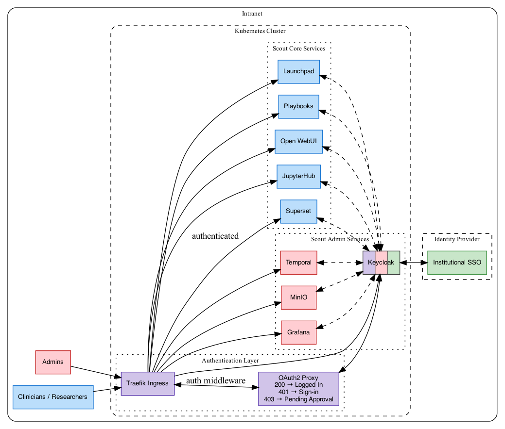

# Scout Authentication & Authorization

This document provides technical details about Scout's authentication and authorization system.

## Table of Contents

- [Architecture Overview](#architecture-overview)
  - [Authentication Flow](#authentication-flow)
  - [Subdomain Routing](#subdomain-routing)
  - [Middleware Stack](#middleware-stack)
- [Components](#components)
  - [Keycloak](#keycloak)
  - [OAuth2 Proxy](#oauth2-proxy)
- [Service Integrations](#service-integrations)
- [Roles & Permissions](#roles--permissions)
  - [Groups](#groups)
  - [User Approval Workflow](#user-approval-workflow)
- [Configuration](#configuration)
  - [Required Inventory Variables](#required-inventory-variables)
  - [Optional Configuration](#optional-configuration)
  - [Client IDs](#client-ids)
  - [Post-Deployment Configuration](#post-deployment-configuration)

## Architecture Overview

Scout's authentication system uses a multi-layered approach combining Keycloak (identity provider), OAuth2 Proxy (authentication middleware), and service-specific OAuth/OIDC integrations.



### Authentication Flow

**First-time authentication:**

1. **User Access**: User requests a Scout service through Traefik ingress
2. **OAuth2 Proxy Check**: Traefik middleware redirects unauthenticated requests to OAuth2 Proxy
3. **Keycloak Authentication**: OAuth2 Proxy redirects to Keycloak for login
4. **Identity Provider**: Keycloak authenticates against configured institutional identity provider
5. **User Registration Check**: OAuth2 Proxy verifies user has the `oauth2-proxy-user` role (inherited from `scout-user` group)
6. **Service Access**: OAuth2 Proxy forwards the request to the target service
7. **Service Authentication**: Service validates user identity and roles with Keycloak OAuth/OIDC

**Subsequent requests:**

For authenticated users in the `scout-user` group, OAuth2 Proxy validates its session cookie and forwards the request. Each service then validates its own session cookie/token internally without needing to re-authenticate with Keycloak.

### Subdomain Routing

Scout services are accessed via subdomains. Each ingress is configured in Traefik and protected by OAuth2 Proxy middleware:

| Subdomain | Service | Protected by OAuth2 Proxy |
|-----------|---------|----------------------------|
| `{server_hostname}` | Launchpad | Yes |
| `superset.{server_hostname}` | Superset analytics | Yes |
| `jupyter.{server_hostname}` | JupyterHub notebooks | Yes |
| `grafana.{server_hostname}` | Grafana monitoring | Yes |
| `temporal.{server_hostname}` | Temporal workflow UI | Yes |
| `minio.{server_hostname}` | MinIO console | Yes |
| `keycloak.{server_hostname}` | Keycloak admin console | No* |

*Keycloak endpoints must remain publicly accessible for services to use OAuth/OIDC flows.

### Middleware Stack

Traefik middlewares enforce authentication:
1. **oauth2-proxy-auth**: Forwards auth requests to OAuth2 Proxy for validation
2. **oauth2-proxy-error**: Redirects 401 errors to OAuth2 Proxy sign-in

Applied to services via ingress annotations:
```yaml
traefik.ingress.kubernetes.io/router.middlewares: >
  kube-system-oauth2-proxy-error@kubernetescrd,
  kube-system-oauth2-proxy-auth@kubernetescrd
```

Add this middleware stack to any new service ingress to enable authentication with OAuth2 Proxy.

## Components

### Keycloak

**Role**: Centralized identity and access management

**Key Features**:
- Single Sign-On (SSO) across all Scout services
- Integration with external institutional identity providers
- Role-based access control (RBAC)
- User approval workflow via email notifications
- Custom Scout realm configuration

**Deployment Details**:
- Uses Keycloak Operator for Kubernetes deployment
- PostgreSQL backend for persistence
- Custom Scout email event listener for user approval notifications
- [Keycloak Config CLI](https://github.com/adorsys/keycloak-config-cli) for realm import and configuration

### OAuth2 Proxy

**Role**: Authentication middleware and user registration gatekeeper

**Key Features**:
- Checks if users have been approved (added to `scout-user` group in Keycloak)
- Redirects unauthenticated users to Keycloak sign-in
- Redirects unauthorized users to pending approval page

## Service Integrations

Each Scout service integrates with Keycloak for authentication and authorization. Ideally, the services would all be able to use headers set by OAuth2 Proxy to get the users JWT token, but due to limitations in some services, implementing OAuth/OIDC clients with Keycloak for each service is necessary.

## Roles & Permissions

### Groups and Client Roles

Keycloak groups automatically assign client-specific roles for each service:

**`scout-admin` group assigns these client roles**:
- OAuth2 Proxy: `oauth2-proxy-user` (required for any Scout access)
- Launchpad: `launchpad-admin` (admin view with all services)
- JupyterHub: `jupyterhub-admin`
- Superset: `superset_admin`
- Grafana: `grafana-admin`
- Temporal: `temporal-system:admin`, `default:admin`
- Open WebUI: `open-webui-admin` (if enabled)
- Keycloak: `realm-admin` (realm management permissions)

**`scout-user` group assigns these client roles**:
- OAuth2 Proxy: `oauth2-proxy-user` (required for any Scout access)
- Launchpad: `launchpad-user` (standard user view)
- JupyterHub: `jupyterhub-user`
- Superset: `superset_alpha`, `superset_sql_lab`
- Open WebUI: `open-webui-user` (if enabled)

**Authentication Flow**:
1. User authenticates via OAuth2 Proxy → checks for `oauth2-proxy-user` client role
2. User accesses specific service → service checks for its own client roles
3. All client roles are mapped to the `groups` claim in JWT tokens via the `microprofile-jwt` scope

**Note**: Scout uses Keycloak groups to assign client roles. Always add users to the `scout-user` group for standard access, and to the `scout-admin` group for elevated admin access instead of assigning client roles directly.

### User Approval Workflow

New users must be approved by an admin before accessing Scout services:

1. **New User Login**: User authenticates via institutional identity provider
2. **Account Creation**: Keycloak creates user account
3. **Pending State**: User has no roles assigned and cannot access services
4. **Admin Notification**: Email sent to admins (via custom event listener)
5. **Admin Action**: Admin assigns user to `scout-user` (and optionally the `scout-admin`) group
6. **Access Granted**: User receives email notification and can access services

See [Post-Deployment Configuration](#post-deployment-configuration) for first-time bootstrap steps.

## Configuration

### Inventory Variables

All secrets must be defined in your inventory file and should be vault-encrypted for production deployments.

**Keycloak Admin Console Credentials**:
```yaml
keycloak_bootstrap_admin_user: admin
keycloak_bootstrap_admin_password: $(openssl rand -hex 16 | ansible-vault encrypt_string --vault-password-file vault/pwd.sh)
keycloak_postgres_password: $(openssl rand -hex 32 | ansible-vault encrypt_string --vault-password-file vault/pwd.sh)
```

**Keycloak Identity Provider**:
Select and configure an identity provider for Keycloak to authenticate against. Scout currently provides configuration support for GitHub and Microsoft.

```yaml
# GitHub
keycloak_default_provider: github
keycloak_gh_client_id: 'your-github-client-id'
keycloak_gh_client_secret: 'your-github-client-secret'

# Microsoft
keycloak_default_provider: microsoft
keycloak_microsoft_client_id: 'your-microsoft-client-id'
keycloak_microsoft_client_secret: 'your-microsoft-secret'
keycloak_microsoft_tenant_id: 'your-tenant-id'
```

For development deployments, you can create a new OAuth app in in Github for Keycloak to use:
https://github.com/organizations/your-org-here/settings/applications

Other Keycloak-supported identity providers can be added in the future. Each provider has different required configuration fields (e.g., Microsoft requires a `tenant_id` beyond the standard `client_id` and `client_secret`), so adding new providers could require additional inventory variables.

**Keycloak Client Secrets** (one for each Scout service):
```yaml
keycloak_oauth2_proxy_client_secret: $(openssl rand -hex 16 | ansible-vault encrypt_string --vault-password-file vault/pwd.sh)
keycloak_superset_client_secret: $(openssl rand -hex 16 | ansible-vault encrypt_string --vault-password-file vault/pwd.sh)
keycloak_jupyterhub_client_secret: $(openssl rand -hex 16 | ansible-vault encrypt_string --vault-password-file vault/pwd.sh)
keycloak_grafana_client_secret: $(openssl rand -hex 16 | ansible-vault encrypt_string --vault-password-file vault/pwd.sh)
keycloak_temporal_client_secret: $(openssl rand -hex 16 | ansible-vault encrypt_string --vault-password-file vault/pwd.sh)
keycloak_minio_client_secret: $(openssl rand -hex 16 | ansible-vault encrypt_string --vault-password-file vault/pwd.sh)
keycloak_launchpad_client_secret: $(openssl rand -hex 16 | ansible-vault encrypt_string --vault-password-file vault/pwd.sh)
```

**OAuth2 Proxy Cookie Secret**:
```yaml
oauth2_proxy_cookie_secret: $(openssl rand -hex 16 | ansible-vault encrypt_string --vault-password-file vault/pwd.sh)
```

**Launchpad NextAuth Cookie Secret**:
```yaml
launchpad_nextauth_secret: $(openssl rand -hex 32 | ansible-vault encrypt_string --vault-password-file vault/pwd.sh)
```

**SMTP for Email Notifications**:
For production deployments, configure SMTP settings for Keycloak to send email notifications:
```yaml
keycloak_smtp_host: 'smtp.example.com'
keycloak_smtp_port: '587'
keycloak_smtp_from: 'scout@example.com'
keycloak_smtp_from_display_name: 'Scout'
keycloak_smtp_auth: 'true'
keycloak_smtp_ssl: 'false'
keycloak_smtp_starttls: 'true'
```

In development environments, omit these settings to use the defaults configured for MailHog and run `make install-mailhog`.

### Post-Deployment Configuration

**1. Login to Scout**:
- Access Launchpad at `https://{server_hostname}` and login through your institutional identity provider
- This will create your Keycloak user account

**2. Access Keycloak Admin Realm Console**:
- Access the Keycloak admin console at `https://keycloak.{server_hostname}`
- Login with `keycloak_bootstrap_admin_user` and `keycloak_bootstrap_admin_password`

**3. Enable Scout Realm Admin Users**:
- Navigate to "Scout" realm
- Add your user to `scout-user` **group** for standard access (required for all users)
- Add your user to `scout-admin` **group** for elevated admin access
- Logout of the Keycloak admin console

**4. Login to Scout**:
- Return to Launchpad at `https://{server_hostname}` and login again through your institutional identity provider
- You should now have access to all Scout services
- Admin services will appear on the Launchpad only if you were added to the `scout-admin` group
