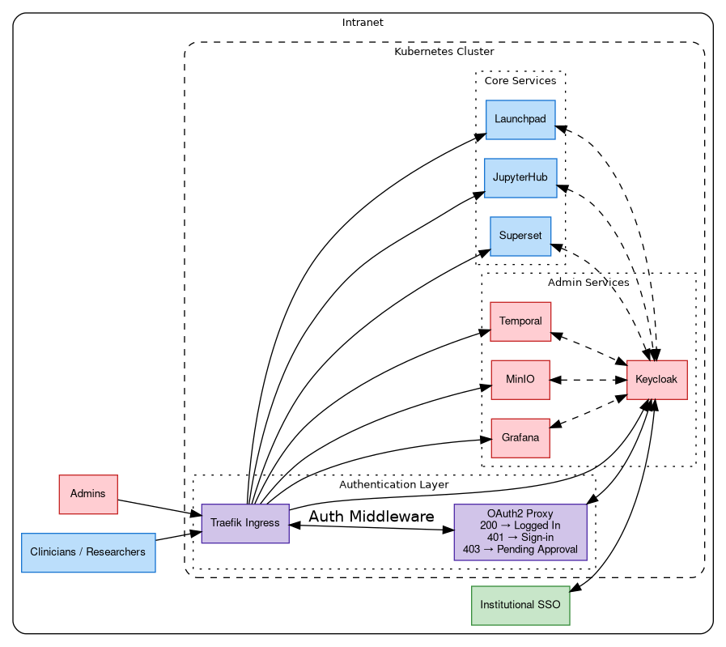

# Scout Authentication & Authorization

This document provides technical details about Scout's authentication and authorization system.

## Table of Contents

- [Architecture Overview](#architecture-overview)
  - [Authentication Flow](#authentication-flow)
  - [Subdomain Routing](#subdomain-routing)
  - [Middleware Stack](#middleware-stack)
- [Components](#components)
  - [Keycloak](#keycloak)
  - [OAuth2 Proxy](#oauth2-proxy)
- [Service Integrations](#service-integrations)
- [Roles & Permissions](#roles--permissions)
  - [Groups](#groups)
  - [User Approval Workflow](#user-approval-workflow)
- [Configuration](#configuration)
  - [Required Inventory Variables](#required-inventory-variables)
  - [Optional Configuration](#optional-configuration)
  - [Client IDs](#client-ids)
  - [Post-Deployment Configuration](#post-deployment-configuration)

## Architecture Overview

Scout's authentication system uses a multi-layered approach combining Keycloak (identity provider), OAuth2 Proxy (authentication middleware), and service-specific OAuth/OIDC integrations.



### Authentication Flow

**First-time authentication:**

1. **User Access**: User requests a Scout service through Traefik ingress
2. **OAuth2 Proxy Check**: Traefik middleware redirects unauthenticated requests to OAuth2 Proxy
3. **Keycloak Authentication**: OAuth2 Proxy redirects to Keycloak for login
4. **Identity Provider**: Keycloak authenticates against configured IDP (GitHub, Microsoft)
5. **User Registration Check**: OAuth2 Proxy verifies user has been assigned the `scout-user` role
6. **Service Access**: OAuth2 Proxy forwards the request to the target service
7. **Service Authentication**: Service validates user identity and roles with Keycloak OAuth/OIDC

**Subsequent requests:**

For authenticated users with the `scout-user` role, OAuth2 Proxy validates its session cookie and forwards the request. Each service then validates its own session cookie/token internally without needing to re-authenticate with Keycloak.

### Subdomain Routing

Scout services are accessed via subdomains. Each ingress is configured in Traefik and protected by OAuth2 Proxy middleware:

| Subdomain | Service | Protected by OAuth2 Proxy |
|-----------|---------|----------------------------|
| `{server_hostname}` | Launchpad | Yes |
| `superset.{server_hostname}` | Superset analytics | Yes |
| `jupyter.{server_hostname}` | JupyterHub notebooks | Yes |
| `grafana.{server_hostname}` | Grafana monitoring | Yes |
| `temporal.{server_hostname}` | Temporal workflow UI | Yes |
| `minio.{server_hostname}` | MinIO console | Yes |
| `keycloak.{server_hostname}` | Keycloak admin console | No* |

*Keycloak endpoints must remain publicly accessible for services to use OAuth/OIDC flows.

### Middleware Stack

Traefik middlewares enforce authentication:
1. **oauth2-proxy-auth**: Forwards auth requests to OAuth2 Proxy for validation
2. **oauth2-proxy-error**: Redirects 401 errors to OAuth2 Proxy sign-in

Applied to services via ingress annotations:
```yaml
traefik.ingress.kubernetes.io/router.middlewares: >
  kube-system-oauth2-proxy-error@kubernetescrd,
  kube-system-oauth2-proxy-auth@kubernetescrd
```

Add this middleware stack to any new service ingress to enable authentication with OAuth2 Proxy.

## Components

### Keycloak

**Role**: Centralized identity and access management

**Key Features**:
- Single Sign-On (SSO) across all Scout services
- Integration with external identity providers (GitHub, Microsoft)
- Role-based access control (RBAC)
- User approval workflow via email notifications
- Custom Scout realm configuration

**Deployment Details**:
- Uses Keycloak Operator for Kubernetes deployment
- PostgreSQL backend for persistence
- Custom Scout email event listener for user approval notifications
- [Keycloak Config CLI](https://github.com/adorsys/keycloak-config-cli) for realm import and configuration

**Identity Providers**:
Keycloak supports multiple identity providers (GitHub, Microsoft). See [Configuration](#configuration) section for setup details.

### OAuth2 Proxy

**Role**: Authentication middleware and user registration gatekeeper

**Key Features**:
- Checks if users have been approved (assigned `scout-user` role from Keycloak)
- Redirects unauthenticated users to Keycloak sign-in
- Redirects unauthorized users to pending approval page

## Service Integrations

Each Scout service integrates with Keycloak for authentication and authorization. Ideally, the services would all be able to use headers set by OAuth2 Proxy to get the users JWT token, but due to limitations in some services, implementing OAuth/OIDC clients with Keycloak for each service is necessary.

## Roles & Permissions

### Groups

Keycloak groups automatically assign roles:

**`scout-admin` group**:
- Grants realm role `scout-admin`
- Includes all admin client roles
- Realm management permissions

**`scout-user` group**:
- Grants realm role `scout-user`
- Includes standard client roles for each service

### User Approval Workflow

New users must be approved by an admin before accessing Scout services:

1. **New User Login**: User authenticates via IDP (GitHub, Microsoft, Institutional SSO)
2. **Account Creation**: Keycloak creates user account
3. **Pending State**: User has no roles assigned and cannot access services
4. **Admin Notification**: Email sent to admins (via custom event listener)
5. **Admin Action**: Admin assigns user to `scout-user` (and optionally the `scout-admin`) group
6. **Access Granted**: User receives email notification and can access services

See [Post-Deployment Configuration](#post-deployment-configuration) for first-time bootstrap steps.

## Configuration

> **Development vs Production**: Production deployments require all secrets to be generated and vault-encrypted. Development environments can omit these variables to use insecure defaults for rapid setup.

### Required Inventory Variables

**Keycloak Admin**:
```yaml
keycloak_bootstrap_admin_user: admin
keycloak_bootstrap_admin_password: $(openssl rand -hex 16 | ansible-vault encrypt_string --vault-password-file vault/pwd.sh)
keycloak_postgres_password: $(openssl rand -hex 32 | ansible-vault encrypt_string --vault-password-file vault/pwd.sh)
```

**OAuth2 Proxy**:
```yaml
oauth2_proxy_cookie_secret: $(openssl rand -hex 16 | ansible-vault encrypt_string --vault-password-file vault/pwd.sh)
```

**Identity Provider**:
Select and configure one IDP for Keycloak to authenticate against.

```yaml
# GitHub
keycloak_default_provider: github
keycloak_gh_client_id: 'your-github-client-id'
keycloak_gh_client_secret: 'your-github-client-secret'

# Microsoft
keycloak_default_provider: microsoft
keycloak_microsoft_client_id: 'your-microsoft-client-id'
keycloak_microsoft_client_secret: 'your-microsoft-secret'
keycloak_microsoft_tenant_id: 'your-tenant-id'
```

For GitHub, create a new OAuth app in your organization settings:
https://github.com/organizations/your-org-here/settings/applications

**Client Secrets** (one for each service):
```yaml
keycloak_oauth2_proxy_client_secret: $(openssl rand -hex 16 | ansible-vault encrypt_string --vault-password-file vault/pwd.sh)
keycloak_superset_client_secret: $(openssl rand -hex 16 | ansible-vault encrypt_string --vault-password-file vault/pwd.sh)
keycloak_jupyterhub_client_secret: $(openssl rand -hex 16 | ansible-vault encrypt_string --vault-password-file vault/pwd.sh)
keycloak_grafana_client_secret: $(openssl rand -hex 16 | ansible-vault encrypt_string --vault-password-file vault/pwd.sh)
keycloak_temporal_client_secret: $(openssl rand -hex 16 | ansible-vault encrypt_string --vault-password-file vault/pwd.sh)
keycloak_minio_client_secret: $(openssl rand -hex 16 | ansible-vault encrypt_string --vault-password-file vault/pwd.sh)
keycloak_launchpad_client_secret: $(openssl rand -hex 16 | ansible-vault encrypt_string --vault-password-file vault/pwd.sh)
```

**Launchpad NextAuth**:
```yaml
launchpad_nextauth_secret: $(openssl rand -hex 32 | ansible-vault encrypt_string --vault-password-file vault/pwd.sh)
```

### Optional Configuration

**SMTP for Email Notifications**:
```yaml
keycloak_smtp_host: 'smtp.example.com'
keycloak_smtp_port: '587'
keycloak_smtp_from: 'scout@example.com'
keycloak_smtp_from_display_name: 'Scout'
keycloak_smtp_auth: 'true'
keycloak_smtp_ssl: 'false'
keycloak_smtp_starttls: 'true'
```

*Dev: Omit for mailhog defaults. Run `make install-mailhog` for email notifications in development.*

### Client IDs

Default client IDs are defined in [`ansible/roles/scout_common/defaults/main.yaml`](../../ansible/roles/scout_common/defaults/main.yaml):
```yaml
keycloak_oauth2_proxy_client_id: oauth2-proxy
keycloak_superset_client_id: superset
keycloak_jupyterhub_client_id: jupyterhub
keycloak_grafana_client_id: grafana
keycloak_temporal_client_id: temporal
keycloak_minio_client_id: minio
keycloak_launchpad_client_id: launchpad
```

These can be overridden in `inventory.yaml` if needed but typically do not need to be changed.

### Post-Deployment Configuration

**1. Login to Scout/Keycloak**:
- Access Launchpad at `https://{server_hostname}` and login through your institutional IDP
- This will create your Keycloak user account

**2. Access Keycloak Admin Realm Console**:
- URL: `https://keycloak.{server_hostname}`
- Login with `keycloak_bootstrap_admin_user` and `keycloak_bootstrap_admin_password`

**3. Create Scout Realm Admin Users**:
- Navigate to "Scout" realm
- Add your user to `scout-user` **group** for standard access (required for all users)
- Add your user to `scout-admin` **group** for elevated admin access
- Logout of the Keycloak Admin Realm Console

**4. Login to Scout**:
- Return to Launchpad at `https://{server_hostname}` and login again through your institutional IDP
- You should now have access to all Scout services
- Admin services will appear on the Launchpad only if you were added to the `scout-admin` group
