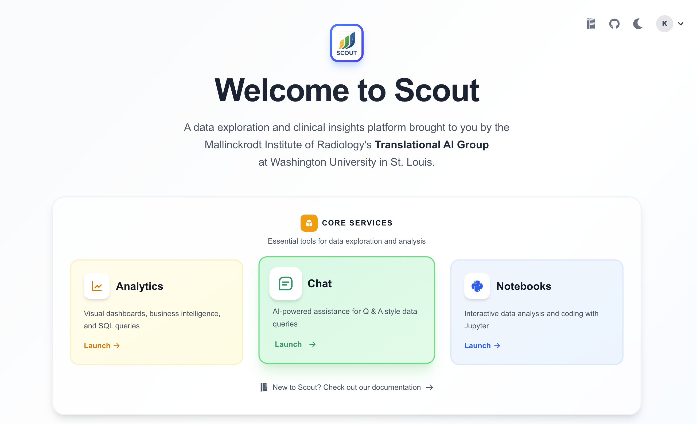
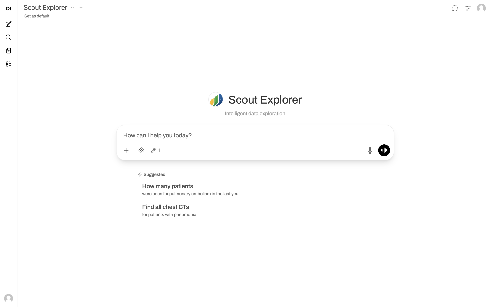
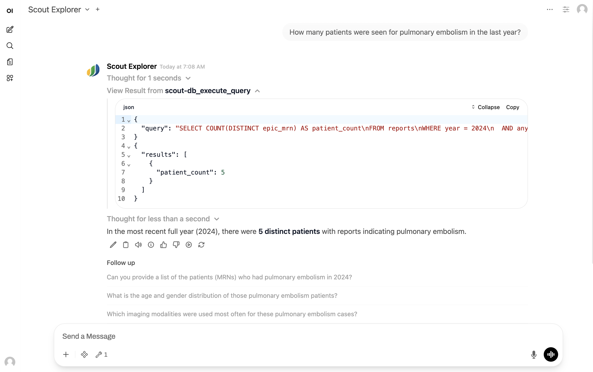

# Scout Chat

Scout Chat provides an AI-powered interface for natural language querying of data in the Scout data lake. Ask questions in plain English and receive data-driven answers from large language models with direct access to the Scout Delta Lake.

**Current version:** Scout Chat currently queries HL7 radiology report data. As Scout expands to incorporate DICOM metadata, pathology reports, and extracted features, Chat will support querying across all data types.

**Note:** The Chat service is optional and may not be enabled in all Scout deployments. If you don't see the Chat option on the Scout Launchpad, contact your administrator.

## Overview

Scout Chat is powered by [Open WebUI](https://docs.openwebui.com/) with [Ollama](https://ollama.com/) and features:

- **Natural language SQL**: Automatically converts your questions into SQL queries against the Delta Lake
- **Scout Explorer model**: A custom-configured large language model that understands the Scout data schema
- **Real-time data access**: Direct connection to Trino via the MCP (Model Context Protocol) tool for querying live data
- **Context-aware responses**: The AI understands the data structure, schema fields, and Scout-specific terminology

## Getting Started

1. Navigate to the [Scout Launchpad](index.md) (your landing page after login)



2. Click on the **Chat** card in the Core Services section
3. Type your question in plain English in the chat input box



4. Press Enter or click the send button
5. The AI will process your question, query the database, and provide an answer


## Example Queries

Scout Chat can answer a wide variety of questions about data in the Scout data lake. The examples below are specific to radiology reports in the current version:

### Basic Counts and Statistics

```
How many radiology reports are in the database?
```

```
How many CT scans were performed in 2024?
```

```
What's the total number of MRI reports?
```

### Filtered Searches

```
Find reports with "pneumonia" in the impression section
```

```
Show me chest X-ray reports from patients over 65 years old
```

```
How many ultrasound reports mention "gallbladder"?
```

### Temporal Analysis

```
How many reports were created in January 2024?
```

```
Show the trend of CT scans by month for the past year
```

```
What's the average patient age in reports from 2023?
```

### Demographic Queries

```
What's the age distribution of patients in the database?
```

```
How many reports are there for male vs. female patients?
```

### Modality and Service Analysis

```
What are the top 5 most common imaging modalities?
```

```
List all unique modalities in the database
```

```
How many reports are there for each diagnostic service?
```

### Diagnosis Codes

```
What are the most common diagnosis codes?
```

```
Find all reports with ICD-10 code J18.9
```

### Complex Queries

```
Compare the number of chest CT scans vs. chest X-rays in 2024
```

```
What percentage of reports have a diagnosis code?
```

```
Show me the average turnaround time from observation to report for MRI studies
```

## Understanding Chat Responses

When you ask a question, Scout Chat responds in the following way:

1. **Interpretation**: The AI acknowledges your question and explains what it will search for
2. **Tool Use**: The AI uses the Trino MCP tool to execute a SQL query (you can expand this section to see the actual query)
3. **Results**: The raw query results are retrieved from the Delta Lake
4. **Analysis**: The AI interprets the results and provides a natural language answer



### Viewing the SQL Query

To see the exact SQL query that was executed, look for the expandable **Tool Use** section in the chat response and click to expand it. You'll see the SQL query, including the table name, columns selected, filters, and any aggregations.

This is useful for:
- Understanding how the AI interpreted your question
- Learning SQL syntax for use in {ref}`Analytics <analytics>` SQL Lab
- Debugging unexpected results
- Adapting queries for use in {ref}`Notebooks <notebooks>`

## Tips for Effective Queries

### Be Specific

Instead of asking vague questions, provide details:

```
❌ Tell me about the data
✓ How many reports are there by modality?
```

### Use Scout Terminology

The AI understands the Scout [data schema](dataschema.md). For radiology reports in the current version, use field names when relevant:

- Modality (CT, MRI, X-ray, etc.)
- Report sections (impression, findings, addendum)
- Patient demographics (age, sex, race, zip code)
- Temporal fields (observation date, message date)
- Diagnosis codes

### Ask Follow-up Questions

Scout Chat maintains conversation context. You can ask follow-up questions:

```
User: How many CT reports are there?
Chat: There are 45,678 CT reports in the database.

User: What about MRI?
Chat: There are 23,456 MRI reports.

User: Show me the total for both
Chat: The combined total of CT and MRI reports is 69,134.
```

### Specify Date Ranges

When asking temporal questions, be specific about the time period:

```
How many reports from January 1, 2024 to December 31, 2024?
```

```
Show me the number of X-rays in the last 6 months
```

### Request Tabular Data

You can ask for data in table format:

```
Give me a table of report counts by modality sorted from highest to lowest
```

```
List the top 10 diagnosis codes with their counts
```

For visualizations and dashboards, copy the results and use {ref}`Analytics <analytics>`.

## Data Privacy and Security

- **Authentication required**: Scout Chat requires Keycloak authentication (same as other Scout services)
- **No data modification**: The Chat interface is read-only and cannot modify or delete data
- **Conversation privacy**: Your chat conversations are private to your user account

## Limitations

### Data Scope

Scout Chat can only query data that exists in the Scout Delta Lake.

**Current version limitations:**
- Only HL7 radiology report data is available
- Cannot access PACS images (DICOM support planned for future versions)
- Cannot query external systems or databases

### Query Complexity

Very complex queries may be better suited for:

- **{ref}`Analytics <analytics>`**: For creating persistent visualizations and dashboards
- **{ref}`Notebooks <notebooks>`**: For complex data transformations, statistical analysis, or machine learning

### Model Limitations

The AI model may occasionally misinterpret ambiguous questions or make mistakes in query construction. Always review the SQL query (in the expandable Tool Use section) to verify it matches your intent.

## Troubleshooting

### Chat Service Not Available

If you don't see the Chat option on the Launchpad, the Chat service may not be enabled in your Scout deployment. Contact your Scout administrator.

### No Response or Errors

If the chat doesn't respond or shows an error:

1. Be patient. With limited GPU resources and many concurrent users, queries can take some time to return.
1. Try again. Occasionally, the GPT-OSS model underlying Scout Chat makes a mistake in its response formatting.
1. Logout and log back in.
1. Contact your Scout administrator if issues persist.

### Unexpected Results

If the results don't match your expectations:

1. Expand the **Tool Use** section to review the SQL query
2. Verify your question was specific and unambiguous
3. The query may be correct, but the data may not contain what you expect
4. Rephrase your question with more specific criteria

### Tool Not Working

If you see errors about the Trino tool not being available, contact your Scout administrator to verify the Trino MCP tool is properly configured.

## Additional Resources

- **[Data Schema](dataschema.md)**: Review the complete Scout data schema to understand available fields
- **[Services Overview](services.md)**: Learn about other Scout services (Analytics, Notebooks)
- **[Tips & Tricks](tips.md)**: General tips for using Scout effectively
