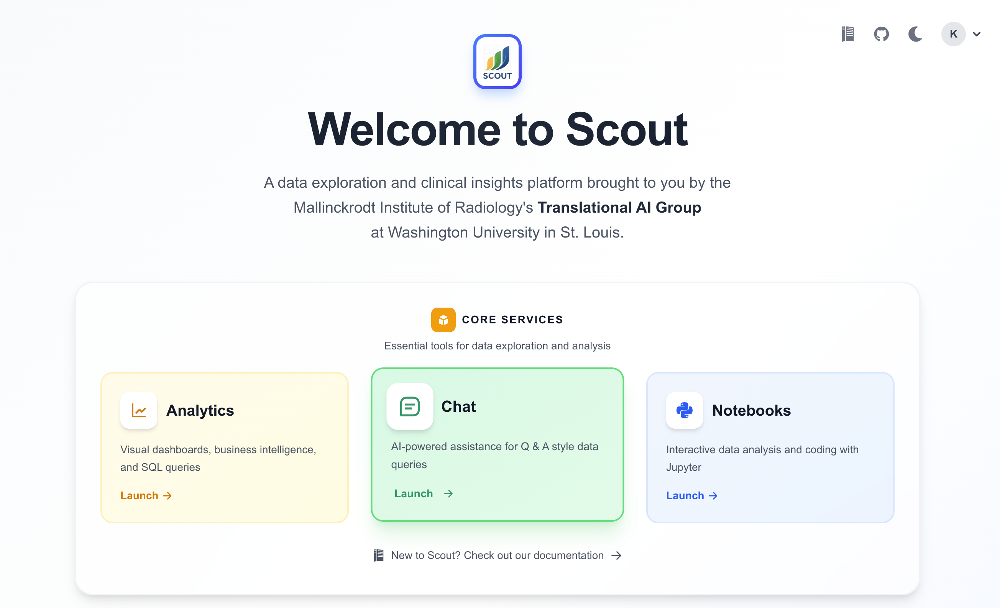
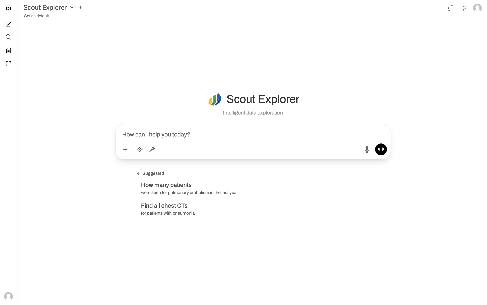
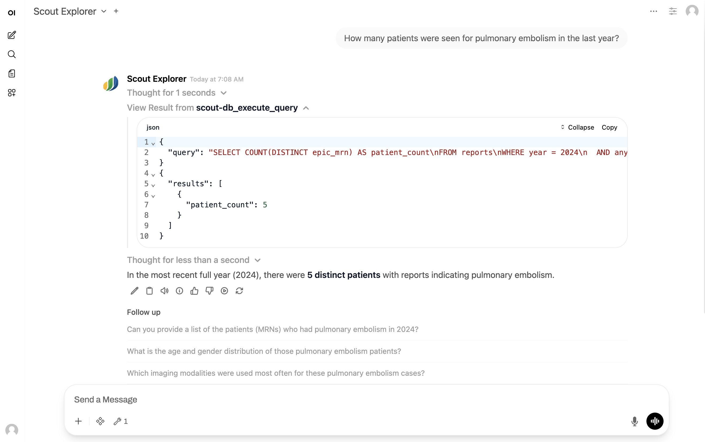

# Chat

Scout Chat provides an AI-powered interface for natural language querying of the Scout data lake. Ask questions in plain English and receive data-driven answers with direct access to your radiology report data.

```{note}
Chat is optional and may not be enabled in all deployments. If you don't see Chat on the Launchpad, contact your administrator.
```



**Current version:** Scout Chat queries HL7 radiology report data. Future versions will support DICOM metadata, pathology reports, and extracted features.

## Overview

Scout Chat is powered by [Open WebUI](https://docs.openwebui.com/) with [Ollama](https://ollama.com/):

- **Natural language SQL**: Converts questions into SQL queries against the data lake
- **Scout Explorer model**: Custom-configured LLM that understands the Scout data schema
- **Data lake access**: Queries Trino through the Scout report-viewer service
- **Interactive results**: Cohort searches render inline as an interactive table
- **Context-aware responses**: Understands Scout terminology, fields, and data structure

## Getting Started

1. Navigate to the [Scout Launchpad](index.md)
2. Click the **Chat** card
3. Type your question in plain English



4. Press Enter to submit
5. The AI queries the database and provides an answer

## Example Queries

### Research & Cohort Identification

- `How many patients have both a chest CT and a lung nodule diagnosis?`
- `Find all patients with MRI reports mentioning "multiple sclerosis" in the findings`
- `What's the age and sex distribution for patients with pneumonia diagnoses?`
- `List unique patients with both CT and PET scans in 2024`

### Operational & Trend Analysis

- `How does CT volume compare this month vs last month?`
- `What's the average turnaround time by modality?`
- `Show me report volumes by month for the past year`

### Text Search & Exploration

- `Find MRI reports mentioning "metastasis" in the findings section`
- `How many reports contain "incidental" in the impression?`
- `Search for chest X-rays with "opacity" in the findings from the last 6 months`

## Understanding Chat Responses

When you ask a question, Scout Chat:

1. **Interprets** your question in its "Thinking" mode
2. **Calls a tool** to fetch data. Three tools are available:
   - `scout_find_reports` for cohort building. Saves the search and renders a browsable table above the reply.
   - `scout_get_reports` for looking up specific reports.
   - `scout_query_sql` for aggregate analytics like counts, distributions, and groupings.
3. **Analyzes** the returned data and provides a natural language answer

### Viewing the SQL Query

For cohort searches (`scout_find_reports`), click **Explain Search** in the results table to see the SQL alongside the model's plain-English description of what it filtered on.

For other tool calls, expand the tool-call block in the reply.



This is useful for:

- Understanding how the AI interpreted your question
- Learning SQL syntax for use in {ref}`Analytics <analytics>` SQL Lab
- Debugging unexpected results
- Adapting queries for {ref}`Notebooks <notebooks>`

## Working with Search Results

When the LLM calls `scout_find_reports`, an interactive table renders above its reply.

- **Sort** by clicking a column header.
- **Filter** with the **Filters** button to narrow by MRN, accession, facility, or the model's match terms.
- **Expand a row** to see the full report text and metadata.
- **Explain Search** shows the SQL alongside the model's plain-English description of what it filtered on.
- **Export CSV** downloads the full search result, not just the current page.

Searches are saved. You can reopen a past search from the **Searches** list at the top of the viewer, and share the URL with other Scout users.

### Refining a Cohort

To narrow or broaden a search, ask a follow-up in the chat:

```
User: Filter to just CT angiography studies
```

The LLM re-emits fresh SQL as a **new** saved search. The original stays intact so you can compare or return to it.

## Tips for Effective Queries

### Be Specific

```
❌ Show me pneumonia cases
✓ How many patients have pneumonia mentioned in the impression, grouped by age decade?
```

### Use Scout Terminology

The AI understands the Scout [data schema](dataschema.md). Reference field names when relevant:

- **Modality**: CT, MRI, X-ray, US, NM, PET, etc.
- **Report sections**: impression, findings, addendum, technician note
- **Demographics**: age, sex, race, zip code
- **Temporal**: observation date, message date, turnaround time
- **Clinical**: diagnosis codes, service name, study instance UID

### Ask Follow-up Questions

Scout Chat maintains conversation context:

```
User: How many patients have "pulmonary embolism" in the impression?
Chat: There are 1,234 unique patients with pulmonary embolism mentioned.

User: What's the age distribution?
Chat: [Shows breakdown by age group]

User: Filter to just CT angiography studies
Chat: [Shows 892 patients with CTA studies mentioning PE]
```

### Specify Date Ranges

```
How many reports from January 2024 to December 2024?
Show me the number of X-rays in the last 6 months
```

### Request Tabular Data

```
Give me a table of report counts by modality, sorted highest to lowest
List the top 10 diagnosis codes with their counts
```

For visualizations, copy results to {ref}`Analytics <analytics>`.

## Data Privacy and Security

- **Authentication required**: Keycloak authentication (same as other Scout services)
- **Read-only access**: Chat cannot modify or delete data
- **External content blocked**: Scout blocks loading images and resources from external websites
- **Conversation privacy**: Chat history is stored on the server and associated with your user account. Other users cannot see your chats unless you share them.

```{note}
**Admin visibility**: Scout administrators have the ability to view user chat histories for quality assurance and support. Avoid including sensitive personal information in your conversations.
```

### External Images and Links

Scout Chat includes security protections that block external content. If the AI generates a response containing an image from an external service (such as a charting website), the image will not render.

```{warning}
**Do not click links to external websites in chat responses.**

LLM responses may contain links to third-party services. These links could potentially contain sensitive data from your query embedded in the URL. If you see a broken image or an external link, do not click it.
```

For visualizations, copy the data to {ref}`Analytics <analytics>` and build charts there.

## Chat Sharing

You can share chat conversations with other authenticated Scout users via share links.

```{warning}
**PHI Risk**: Chat conversations may contain Protected Health Information (PHI) from query results. Before sharing or downloading chats, ensure you are complying with your institution's data governance policies and HIPAA requirements.
```

### Creating a Share Link

1. Open the chat you want to share
2. Click the **three-dot menu** (⋮) on the chat
3. Select **Share**
4. Click **Copy Link** to generate a shareable URL

The link creates a **snapshot** of the conversation at that moment. New messages added after sharing won't appear unless you update the link.

### Who Can View Shared Chats

Shared chats are **only accessible to authenticated users** on your Scout instance. Recipients must:

- Have a Scout account
- Be logged in to Scout Chat

Unauthenticated users will be redirected to the login page.

### Updating a Share Link

If you add messages to a shared chat and want to include them:

1. Open the chat and click the **three-dot menu**
2. Select **Share**
3. The share modal shows the previously shared snapshot
4. Click **Update** to refresh the snapshot with new messages

### Deleting a Share Link

To revoke access to a shared chat:

1. Open the chat and click the **three-dot menu**
2. Select **Share**
3. Click **Delete this link**

Once deleted, the share link becomes invalid and viewers can no longer access the chat.

### Downloading Chats

```{warning}
**Do not download chats containing PHI** unless you have appropriate authorization and secure storage. Downloaded chat files may contain patient identifiers, diagnosis codes, and other sensitive information extracted from query results.
```

Because of PHI concerns, we recommend using chat sharing instead of download when you can. If this is not suitable for your use case, consider whether {ref}`Scout Analytics <analytics>` or {ref}`Scout Notebooks <notebooks>` would meet your need.

## Limitations

### Data Scope

Scout Chat queries data in the Scout data lake only.

**Current version:**
- HL7 radiology report data only
- No PACS image access (DICOM support planned)
- No external database queries

### Query Complexity

For advanced analysis, consider:

- **{ref}`Analytics <analytics>`**: Persistent visualizations, dashboards, and complex SQL
- **{ref}`Notebooks <notebooks>`**: Statistical analysis, machine learning, and custom transformations

### Model Limitations

The AI may occasionally misinterpret questions or generate incorrect queries. Use **Explain Search** on the results table (or expand the tool-call block for non-cohort tools) to review the SQL and verify it matches your intent.

## Troubleshooting

### Chat Service Not Available

If Chat doesn't appear on the Launchpad, the service may not be enabled in your deployment. Contact your Scout administrator.

### No Response or Errors

1. **Be patient** — GPU resources may be limited with concurrent users
2. **Retry** — Occasionally the model makes formatting errors
3. **Log out and back in** — Refreshes your session
4. **Contact admin** — If issues persist

### Unexpected Results

1. Click **Explain Search** on the results table (or expand the tool-call block for non-cohort tools) to review the SQL
2. Verify your question was specific and unambiguous
3. Check if the data contains what you expect
4. Rephrase with more specific criteria

### Tool Not Working

If you see tool errors, contact your administrator.

## Additional Resources

- **[Data Schema](dataschema.md)**: Available fields and their meanings
- **[Services Overview](services.md)**: Analytics, Notebooks, and other Scout services
- **[Tips & Tricks](tips.md)**: General Scout usage tips