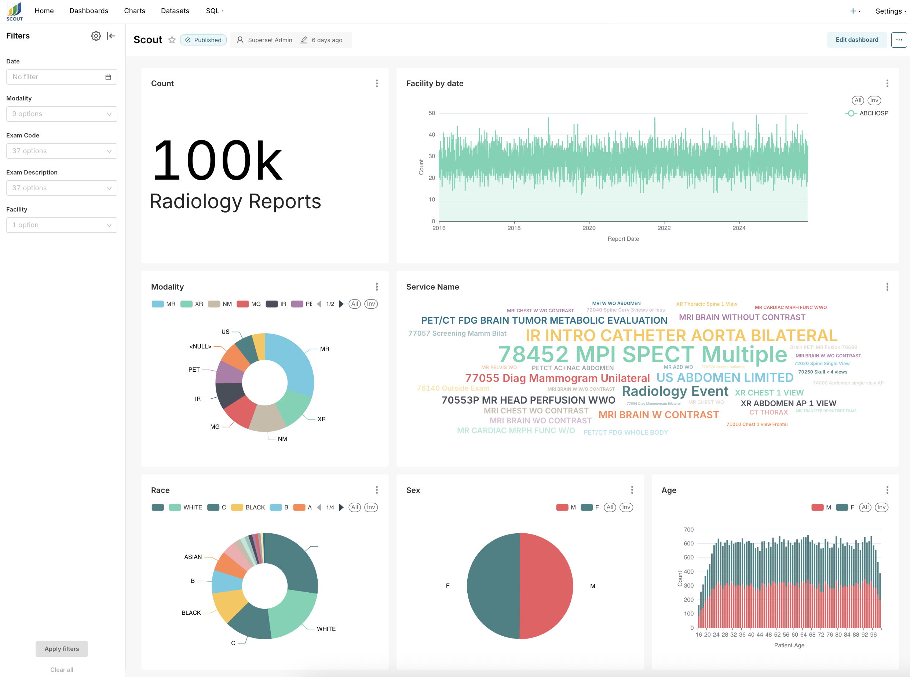
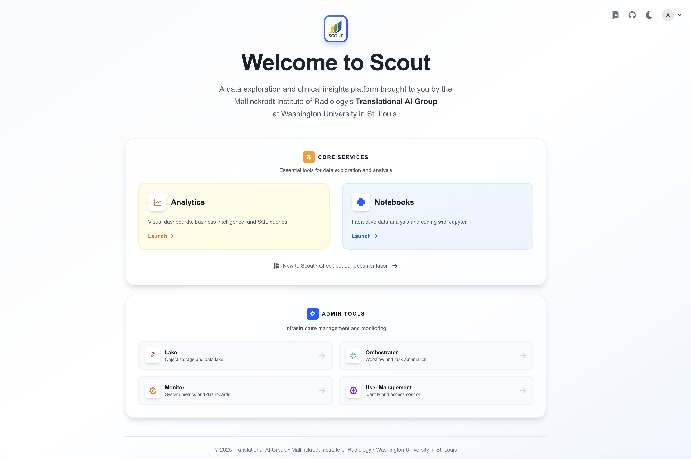

# Scout Radiology Report Explorer

Welcome to the Scout Radiology Report Explorer documentation! 

The Scout Radiology Report Explorer is designed to help users access and analyze large volumes of HL7 radiology reports.
HL7 radiology reports are processed and ingested into a data lake where they are made available for exploration and analysis.

## Quickstart

### Scout Analytics
Your initial landing page is the Scout Dashboard. It is designed to give you an overview of all report data. From here, you can
analyze and explore the data within Scout Analytics, either 
[graphically](https://superset.apache.org/docs/using-superset/creating-your-first-dashboard) or via 
[SQL Lab](https://incubator-superset.readthedocs.io/en/latest/sqllab.html) 
(see the [Trino SQL documentation](https://trino.io/docs/current/language.html) for a general reference to the Trino SQL syntax and language support).




### Scout Launchpad
From Scout Analytics, click the "Scout" icon in the top left to navigate to the Scout Launchpad, where you can access other Scout 
services, including Notebooks, this documentation, and the services for system administrators.




### Scout Notebooks

From the Launchpad, you may select "Notebooks" to launch a Jupyter notebook preloaded with
[PySpark](https://spark.apache.org/docs/latest/api/python/index.html) for completely customizable data analysis.
An example Jupyter notebook with sample code to access and analyze the radiology report data is provided in `Scout/Quickstart.ipynb`
This notebook provides example code using Spark SQL to search for reports, filter by various criteria, and export the results to CSV files.


## Next Steps

* Review the [Data Schema](dataschema.md) to understand the structure of the report
data in the data lake and the mapping of HL7 fields to the report table columns.

* The [Services](services.md) page provides an overview of the main services that make up the Scout Rad Report Explorer.
Superset analytics and Jupyter notebooks are provided to users to facilitate data exploration and analysis. Scout is backed by
Temporal for data ingestion and processing, Delta Lake and MinIO for efficient data storage and management, and Prometheus and Grafana
for monitoring and visualization.

* Explore the [Tips & Tricks](tips.md) page for helpful hints for using Scout services.

* Report an issue via [Jira](https://xnat.atlassian.net/jira/software/projects/SCOUT/summary)

```{toctree}
:hidden:
services
dataschema
tips
```
