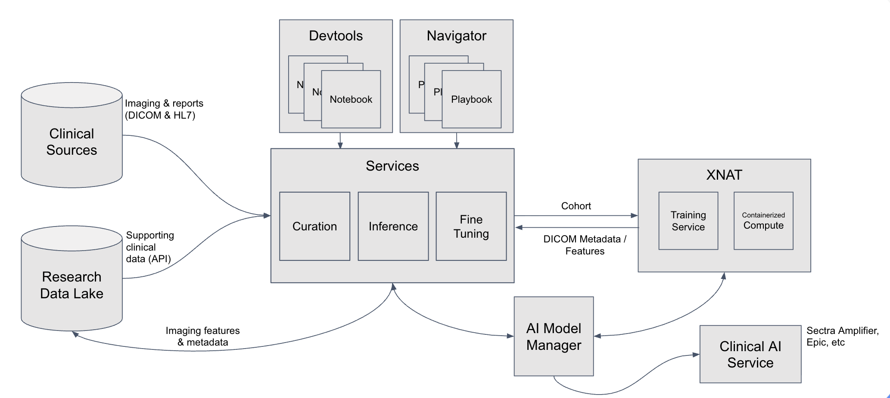
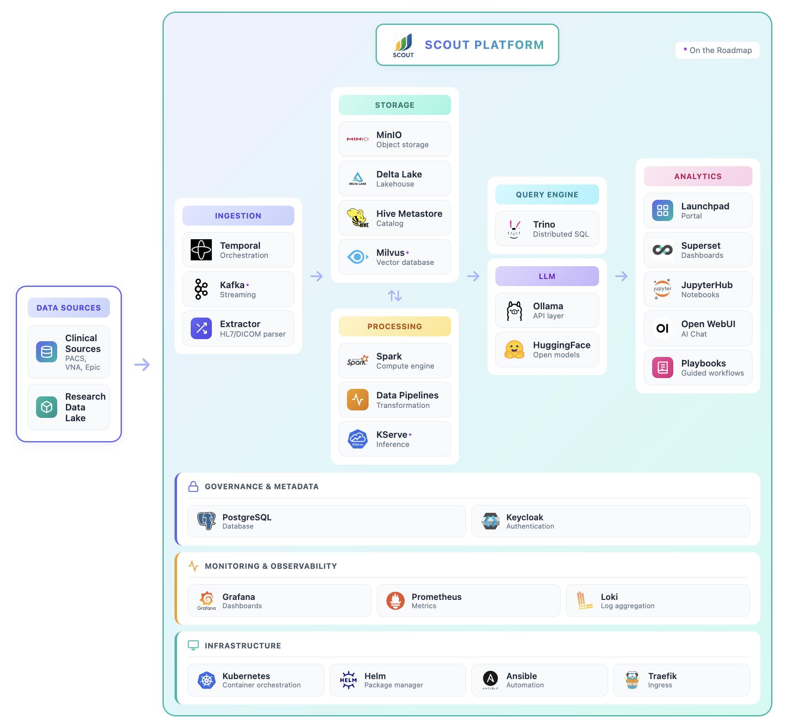

# Architecture

Scout consists of several services that work together to process medical imaging data into a data lake and provide user interfaces for accessing and analyzing the data.

**Current version:** Scout currently ingests HL7 radiology reports. Future versions will incorporate DICOM metadata, pathology reports, and extracted features in concert with XNAT.

## Overview

Scout is a modern, distributed data platform deployed on Kubernetes.

## Backend Services

The following services support Scout's data processing, storage, and monitoring infrastructure. Administrators can access these services from the **Admin Tools** section of the Scout Launchpad.

(orchestrator_ref)=
### Orchestrator

[Temporal](https://temporal.io/) is a workflow orchestration platform that manages the execution of data ingestion workflows. Temporal ensures reliable, fault-tolerant processing of HL7 reports from log files into the data lake.

**Key responsibilities:**
- Coordinate {ref}`Extractor <extractor_ref>` service activities
- Retry failed operations automatically
- Track workflow execution history and status
- Provide visibility into data ingestion progress

**Access:** Administrators can monitor workflows and view execution details through the Temporal Web UI.

**Learn more:** See [Report Ingestion](../operate/ingest.md) for details on launching and monitoring ingestion workflows.

(extractor_ref)=
### Extractor

Extractor services are responsible for extracting data from source systems and loading them into the data lake. Scout uses a two-stage medallion architecture:

**Current implementation:** The HL7 extractor processes radiology reports from hospital information systems.

**HL7 Log Extractor (Bronze Layer)**
- Parses daily HL7 log files exported from hospital systems
- Splits log files into individual HL7 messages
- Uploads raw HL7 messages to MinIO object storage

**HL7 Transformer (Silver Layer)**
- Parses HL7 message structure using Python
- Transforms HL7 fields into structured columns (see [Data Schema](dataschema.md))
- Writes transformed data to Delta Lake using PySpark

**Monitoring:** Administrators can monitor extractor performance using:
- **Grafana HL7 Ingest Dashboard**: Metrics, status, and performance graphs
- **Grafana Logs**: Detailed log entries for debugging (Drilldown > Logs)
- **Temporal UI**: Live view of running workflows and activity execution

### Lake

The Lake service provides the data storage foundation for Scout using a medallion architecture:

**Bronze Layer**: Raw HL7 messages stored as-is in object storage

**Silver Layer**: Structured, queryable data transformed into the Scout [Data Schema](dataschema.md)

**Technology stack:**
- **[MinIO](https://min.io/)**: S3-compatible distributed object storage for data persistence
- **[Delta Lake](https://delta.io/)**: Lakehouse storage format providing ACID transactions, versioning, and time travel
- **[Hive Metastore](https://hive.apache.org/)**: Centralized metadata catalog for table schemas and partitions
- **[Trino](https://trino.io/)**: Distributed SQL query engine connecting user services (Superset, Notebooks, Chat) to the data lake

**Access:** Administrators can access the MinIO web console to view buckets, objects, and storage metrics.

### Monitor

[Grafana](https://grafana.com/) provides comprehensive monitoring and observability for the Scout platform. Administrators can track system performance, view metrics, and troubleshoot issues through pre-configured dashboards and log aggregation.

**Pre-configured dashboards:**
- **Scout HL7 Ingest**: Extractor performance, ingestion rates, and errors
- **Kubernetes**: Cluster health, node resources, and pod status
- **Temporal**: Workflow execution metrics and task queue status
- **MinIO**: Storage usage and API performance
- **Database**: PostgreSQL and Cassandra metrics

**Log aggregation:**
- All service logs collected by [Loki](https://grafana.com/oss/loki/)
- Searchable and filterable in Grafana Explore
- Correlate logs across services for debugging

**Access:** Administrators can access Grafana through the Scout Launchpad Admin Tools section.

**Learn more:** See [Monitoring](../operate/monitoring.md) for guidance on using Grafana dashboards effectively.

### User Management

[Keycloak](https://www.keycloak.org/) provides identity and access management for Scout. It handles authentication, user registration, and role-based access control for all Scout services.

**Key features:**
- Single sign-on (SSO) across all Scout services
- Integration with institutional identity providers (SAML, OIDC)
- User registration with administrator approval workflow
- Role-based access control (admin vs. regular users)

**Access:** Administrators can manage users, roles, and authentication settings through the Keycloak admin console.

**Learn more:** See [Authentication](../user/authentication.md) for details on the user login and approval process.
