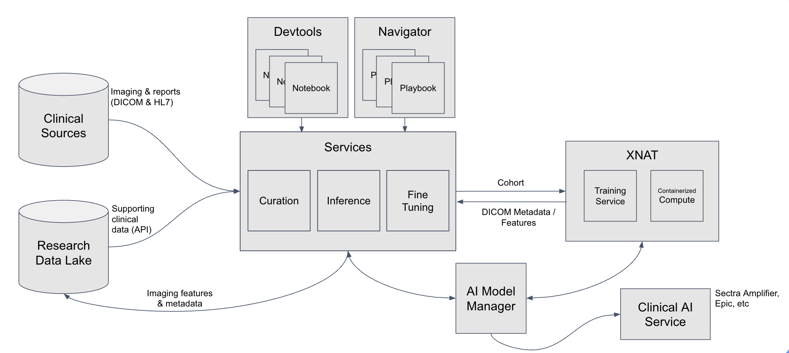

# Services

Scout consists of several services that work together to process medical imaging data into a data lake and provide user interfaces for accessing and analyzing the data.

**Current version:** Scout currently ingests HL7 radiology reports. Future versions will incorporate DICOM metadata, pathology reports, and extracted features in concert with XNAT.

## User Services

Scout provides three primary user-facing services for data exploration and analysis. These are accessible from the Scout Launchpad after [authentication](authentication.md).

(analytics)=
### Analytics

[Apache Superset](https://superset.apache.org/) provides a user-friendly interface for exploring and visualizing data in the Scout data lake. Superset offers two main approaches:

- **No-code visualization builder**: Create interactive charts, graphs, and dashboards without writing SQL
- **SQL Lab**: An integrated SQL IDE for advanced queries and data exploration

Under the hood, Superset queries the data lake using [Trino](https://trino.io/), a distributed SQL query engine that provides fast, efficient access to large datasets stored in Delta Lake.

**Key Features:**
- Pre-built Scout Dashboard with overview metrics
- Interactive visualizations (charts, tables, pivot tables, etc.)
- Direct SQL querying with autocomplete
- Export results to CSV, Excel, or other formats
- Share dashboards with other users

**Learn more:** [Superset documentation](https://superset.apache.org/docs/intro)

### Chat

[Open WebUI](https://docs.openwebui.com/) with [Ollama](https://ollama.com/) provides an AI-powered chat interface for natural language querying of data in the Scout data lake. Ask questions in plain English and receive data-driven answers from large language models with direct access to the Delta Lake.

The Chat service is configured with:
- **Natural language SQL**: Automatically converts your questions into SQL queries
- **Trino MCP integration**: Direct access to the Delta Lake for real-time data retrieval
- **Context-aware responses**: The AI understands the Scout data schema and can provide detailed analyses

**Example queries** (for radiology reports in the current version):
- "How many CT scans were performed in 2024?"
- "What are the most common diagnoses in chest X-rays?"
- "Show me the age distribution of patients with MRI reports"

**Note:** The Chat service is optional and may not be enabled in all Scout deployments. For detailed information about using the Chat interface, see the [Chat documentation](chat.md).

(notebooks)=
### Notebooks

[JupyterHub](https://jupyterhub.readthedocs.io/) provides an interface for power users to perform custom data analysis using Python code. Each user receives their own single-user [Jupyter notebook](https://jupyter.org/) environment with full access to data in the Scout data lake.

**Key Features:**
- Pre-installed [PySpark](https://spark.apache.org/docs/latest/api/python/index.html) for large-scale data processing
- Example `Scout/Quickstart.ipynb` notebook with sample queries and analysis code for radiology reports
- Export results to CSV, JSON, Parquet, or other formats
- Create custom visualizations and statistical analyses

**Use cases:**
- Complex data transformations and aggregations
- Statistical analysis and machine learning
- Custom report generation
- Data quality checks and validation

**Important:** Notebook servers automatically shut down after a period of time (default: 2 days, configurable by your
deployment) to conserve resources. Your files in `/home/jovyan/` are preserved, but in-memory variables (DataFrames,
models, etc.) are lost. Save your work regularly and checkpoint intermediate results. See {ref}`Tips & Tricks <notebooks_ref>`
for checkpointing strategies.

## Backend Services

The following services support Scout's data processing, storage, and monitoring infrastructure. Administrators can access these services from the **Admin Tools** section of the Scout Launchpad.

(orchestrator_ref)=
### Orchestrator

[Temporal](https://temporal.io/) is a workflow orchestration platform that manages the execution of data ingestion workflows. Temporal ensures reliable, fault-tolerant processing of HL7 reports from log files into the data lake.

**Key responsibilities:**
- Coordinate {ref}`Extractor <extractor_ref>` service activities
- Retry failed operations automatically
- Track workflow execution history and status
- Provide visibility into data ingestion progress

**Access:** Administrators can monitor workflows and view execution details through the Temporal Web UI.

**Learn more:** See [Report Ingestion](ingest.md) for details on launching and monitoring ingestion workflows.

(extractor_ref)=
### Extractor

Extractor services are responsible for extracting data from source systems and loading them into the data lake. Scout uses a two-stage medallion architecture:

**Current implementation:** The HL7 extractor processes radiology reports from hospital information systems.

**HL7 Log Extractor (Bronze Layer)**
- Parses daily HL7 log files exported from hospital systems
- Splits log files into individual HL7 messages
- Uploads raw HL7 messages to MinIO object storage

**HL7 Transformer (Silver Layer)**
- Parses HL7 message structure using Python
- Transforms HL7 fields into structured columns (see [Data Schema](dataschema.md))
- Writes transformed data to Delta Lake using PySpark

**Monitoring:** Administrators can monitor extractor performance using:
- **Grafana HL7 Ingest Dashboard**: Metrics, status, and performance graphs
- **Grafana Logs**: Detailed log entries for debugging (Drilldown > Logs)
- **Temporal UI**: Live view of running workflows and activity execution

### Lake

The Lake service provides the data storage foundation for Scout using a medallion architecture:

**Bronze Layer**: Raw HL7 messages stored as-is in object storage

**Silver Layer**: Structured, queryable data transformed into the Scout [Data Schema](dataschema.md)

**Technology stack:**
- **[MinIO](https://min.io/)**: S3-compatible distributed object storage for data persistence
- **[Delta Lake](https://delta.io/)**: Lakehouse storage format providing ACID transactions, versioning, and time travel
- **[Hive Metastore](https://hive.apache.org/)**: Centralized metadata catalog for table schemas and partitions
- **[Trino](https://trino.io/)**: Distributed SQL query engine connecting user services (Superset, Notebooks, Chat) to the data lake

**Access:** Administrators can access the MinIO web console to view buckets, objects, and storage metrics.

### Monitor

[Grafana](https://grafana.com/) provides comprehensive monitoring and observability for the Scout platform. Administrators can track system performance, view metrics, and troubleshoot issues through pre-configured dashboards and log aggregation.

**Pre-configured dashboards:**
- **Scout HL7 Ingest**: Extractor performance, ingestion rates, and errors
- **Kubernetes**: Cluster health, node resources, and pod status
- **Temporal**: Workflow execution metrics and task queue status
- **MinIO**: Storage usage and API performance
- **Database**: PostgreSQL and Cassandra metrics

**Log aggregation:**
- All service logs collected by [Loki](https://grafana.com/oss/loki/)
- Searchable and filterable in Grafana Explore
- Correlate logs across services for debugging

**Access:** Administrators can access Grafana through the Scout Launchpad Admin Tools section.

**Learn more:** See [Tips & Tricks](tips.md) for guidance on using Grafana dashboards effectively.

### User Management

[Keycloak](https://www.keycloak.org/) provides identity and access management for Scout. It handles authentication, user registration, and role-based access control for all Scout services.

**Key features:**
- Single sign-on (SSO) across all Scout services
- Integration with institutional identity providers (SAML, OIDC)
- User registration with administrator approval workflow
- Role-based access control (admin vs. regular users)

**Access:** Administrators can manage users, roles, and authentication settings through the Keycloak admin console.

**Learn more:** See [Authentication](authentication.md) for details on the user login and approval process.
