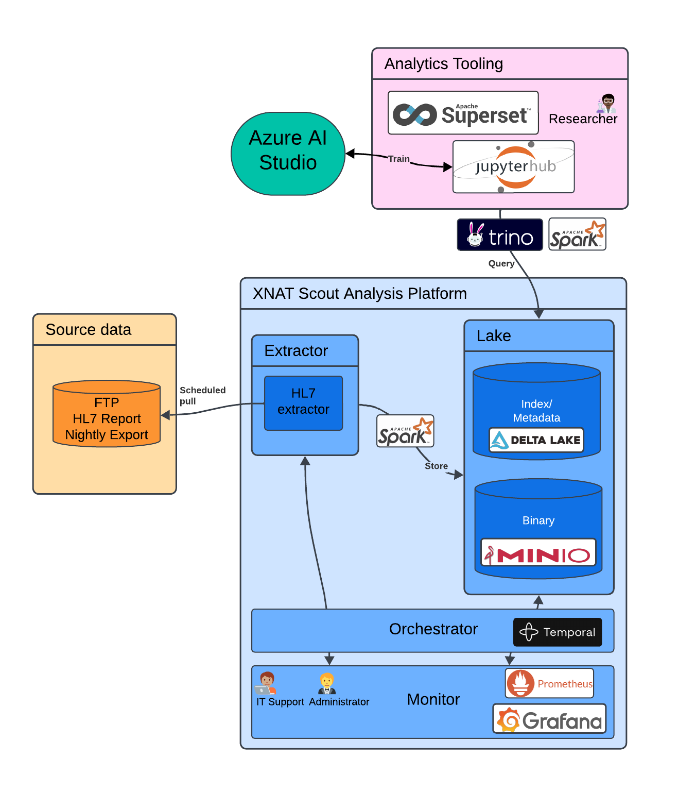

# Services

The Scout Radiology Report Explorer consists of several services that work together to process HL7 radiology reports into a 
data lake, and provide a user interface for users to access and analyze the data.

Below is a list of the main services that make up Scout.

## User Services

### Analytics

#### Superset

[Apache Superset](https://superset.apache.org/) allows users to explore and visualize the radiology report data with a simple, no-code visualization builder or 
using an integrated SQL IDE.

Under the hood, Superset is able to query the Delta Lake using [Trino](https://trino.io/).

#### JupyterHub

[JupyterHub](https://jupyterhub.readthedocs.io/en/stable/) an interface for power-users to access rad report data.
It provides single-user [Jupyter notebooks](https://jupyter.org/), which can be used to run Python code and interact 
with report data in the data lake. On first login, users are given a Jupyter notebook with example code to extract 
and analyze data from the HL7 reports using [PySpark](https://spark.apache.org/docs/latest/api/python/index.html).

The [Jupyter AI](https://jupyter-ai.readthedocs.io/en/latest/) extension is also available to users, which provides
AI-powered code suggestions and completions to help users write queries and analyze data. Configure the Jupyter AI 
extension with your LLM provider of choice (e.g., OpenAI, Anthropic, etc.) to enable this feature.

## Admin Services

The following admin services support the system's backend operations. 

### Monitor

[Grafana](https://grafana.com/) is a monitoring and visualization tool used to track system performance and metrics.
Grafana dashboards for Temporal, MinIO, Kubernetes, and other services are available to system administrators.

### Lake

[MinIO](https://min.io/) is an object storage service that is used to store HL7 reports and other data. Jupyter 
notebooks users can access MinIO to read the rad report data stored here.

### Orchestrator

[Temporal](https://temporal.io/) is a workflow orchestration service that Scout uses to manage the ingestion and 
processing of HL7 reports. Workflow information is available in the Temporal UI and can be used to monitor and debug
the data ingestion process.
