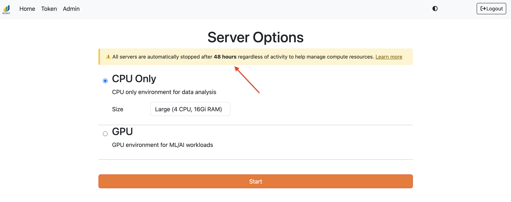

# Tips & Tricks

This page provides helpful tips for using Scout services effectively.

## Analytics (Superset)

### Query Performance

- **Use partitioned columns**: Filter on the `year` column (derived from `message_dt`) for better query performance
- **Limit result sets**: Add `LIMIT` clauses to large queries during exploration
- **Leverage Delta Lake columnar format**: Select only the columns you need rather than `SELECT *`
- **Use SQL Lab for testing**: Test and refine queries in SQL Lab before creating visualizations

### Creating Dashboards

- **Start with the Scout Dashboard**: The pre-built Scout Dashboard provides a good template for creating custom dashboards
- **Use filters**: Add dashboard-level filters to make dashboards more interactive
- **Save queries as datasets**: Complex queries can be saved as virtual datasets for reuse across multiple charts

## Chat

### Getting Better Results

- **Be specific**: Include details like modality, date ranges, or specific fields in your questions
- **Use Scout terminology**: Reference field names from the [data schema](dataschema.md) for more accurate queries
- **Check the SQL**: Expand the "View Result from scout-db" section to verify the AI generated the correct query
- **Iterate**: Ask follow-up questions to refine results

### When to Use Chat vs. Analytics vs. Notebooks

- **Use Chat for**: Quick exploratory questions, ad-hoc analysis, learning about the data
- **Use Analytics for**: Creating visualizations, building dashboards, sharing results with others
- **Use Notebooks for**: Complex transformations, statistical analysis, machine learning, custom exports

(notebooks_ref)=
## Notebooks (JupyterHub)

### PySpark Best Practices

- **Filter early**: Apply filters as early as possible to reduce data processing
- **Use array functions**: Filter array columns with `F.exists()`:
  ```python
  from pyspark.sql import functions as F
  df.filter(F.exists("diagnoses", lambda x: x.diagnosis_code == "J18.9"))
  ```
- **Leverage convenience columns**: Use `epic_mrn` or dynamically-created ID columns instead of parsing `patient_ids` array
- **Cache frequently-used DataFrames**: Use `.cache()` on DataFrames you'll query multiple times

### Working with Report Sections

The Delta Lake schema includes parsed report sections:
- `report_section_findings`
- `report_section_impression`
- `report_section_addendum`
- `report_section_technician_note`

Use these for targeted text analysis instead of parsing `report_text`.

### Saving Intermediate Results

Jupyter notebook servers automatically shut down after a configurable period of runtime (2 days by default). You'll see the specific timeout for your deployment displayed in a notification banner when you start your server:



Your notebook files and home directory (`/home/jovyan/`) persist, but in-memory variables are lost. To avoid potentially losing any important work, save notebooks frequently (Ctrl+S / Cmd+S) and save large DataFrames and intermediate results to disk.

**Spark DataFrames (Parquet):**
```python
# Save after expensive computation
df.write.parquet('/home/jovyan/checkpoints/results.parquet')

# Resume later
df = spark.read.parquet('/home/jovyan/checkpoints/results.parquet')
```

**Pandas DataFrames:**
```python
# CSV (human-readable)
df.to_csv('/home/jovyan/checkpoints/results.csv', index=False)
df = pd.read_csv('/home/jovyan/checkpoints/results.csv')

# Parquet (faster, preserves types)
df.to_parquet('/home/jovyan/checkpoints/results.parquet')
df = pd.read_parquet('/home/jovyan/checkpoints/results.parquet')
```

**Python objects (pickle):**
```python
import pickle

# Save any Python object
with open('/home/jovyan/checkpoints/my_data.pkl', 'wb') as f:
    pickle.dump({'results': results, 'config': config}, f)

# Load it back
with open('/home/jovyan/checkpoints/my_data.pkl', 'rb') as f:
    data = pickle.load(f)
```

**ML models:**
```python
# scikit-learn
import joblib
joblib.dump(model, '/home/jovyan/models/classifier.joblib')
model = joblib.load('/home/jovyan/models/classifier.joblib')

# PyTorch
torch.save(model.state_dict(), '/home/jovyan/models/checkpoint.pth')
model.load_state_dict(torch.load('/home/jovyan/models/checkpoint.pth'))
```

## Monitor (Grafana)

### Viewing Dashboards and Logs

- **Accessing Scout Dashboards**: Navigate to **Dashboards > Scout** in Grafana
- **Accessing Service Logs**: Go to **Drilldown > Logs** section or use **Explore > Loki**
- **Adjust Time Ranges**: Modify the time range to focus on specific periods. Services without activity during the selected time range will not appear
- **Click on Legends**: Click legend entries to isolate specific metrics or log entry types (e.g., filter to only errors)

### Dashboard Variables

- Many dashboards include variables (namespace, node, pod, etc.) at the top
- Use these to filter data for targeted analysis
- Multiple selections are often supported

### Correlating Logs Across Services

To view logs from multiple services in a single view:
1. In the Logs panel, select "Include" for each service you want to view
2. Click "Show Logs"
3. Search, filter, and identify patterns across services

This is especially useful for debugging issues that span multiple components.

### Disk Usage Monitoring

- **Kubernetes PV/PVC Metrics**: May not work in on-premises deployments
- **Alternative**: Use the **Node Exporter** dashboard to monitor disk usage for each node and mount point

### Saving Dashboard Changes

- **Provisioned dashboards** (in Dashboards > Scout) cannot be modified directly in Grafana
- **To make changes**:
  1. Save the dashboard as a new one with a different name
  2. Make your modifications
  3. Export the updated JSON
  4. (Admins) Update the dashboard configuration in the Scout repository for future deployments

## General Tips

### Keyboard Shortcuts

- **Superset SQL Lab**:
  - `Ctrl/Cmd + Enter`: Run query
  - `Ctrl/Cmd + Shift + Enter`: Run selected text

- **JupyterHub**:
  - `Shift + Enter`: Run cell and move to next
  - `Ctrl + Enter`: Run cell and stay
  - `Esc` then `A`: Insert cell above
  - `Esc` then `B`: Insert cell below

### Exporting Data

- **From Analytics**: Click Export in query results (CSV, Excel, etc.)
- **From Chat**: Copy data from chat responses, or use the SQL query in Analytics/Notebooks for larger exports
- **From Notebooks**: Use `.toPandas().to_csv()`, `.write.parquet()`, or other PySpark export methods

### Getting Help

- **Documentation**: Review the [data schema](dataschema.md), [services](services.md), and [ingestion](ingest.md) docs
- **Issue Tracking**: Report bugs or request features via [Jira](https://xnat.atlassian.net/jira/software/projects/SCOUT/summary)
- **Admin Tools**: Contact your Scout administrator for access to Monitor, Orchestrator, or User Management interfaces
