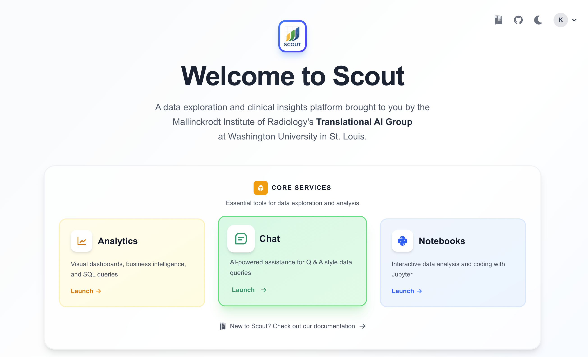
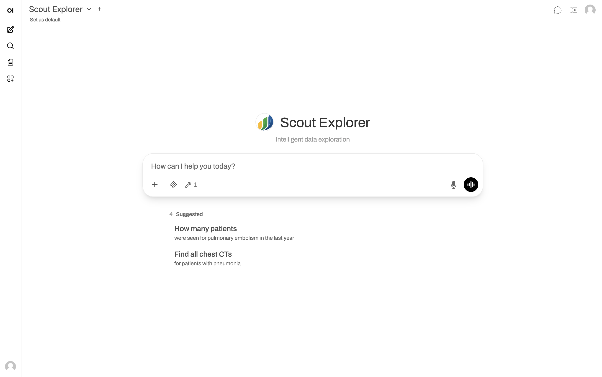
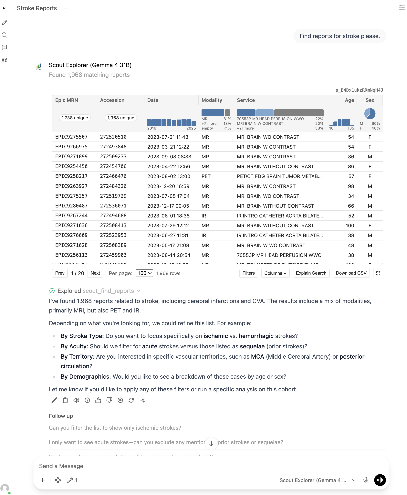
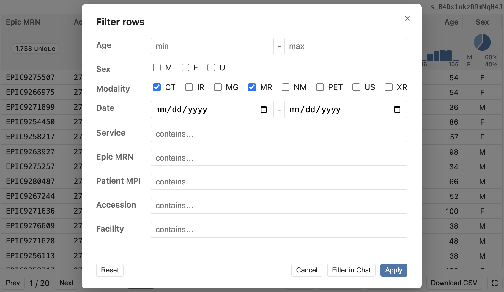
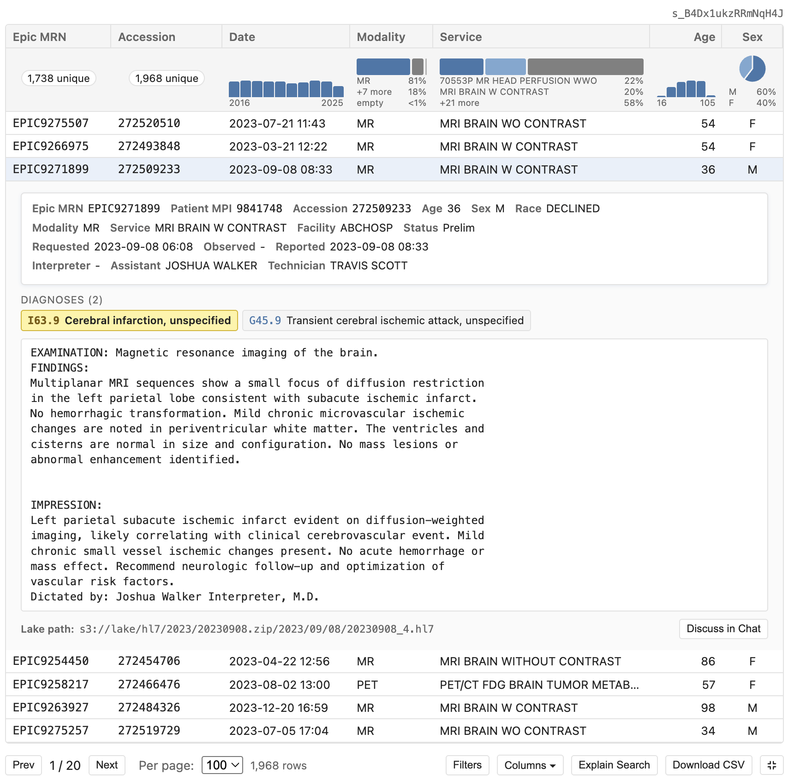
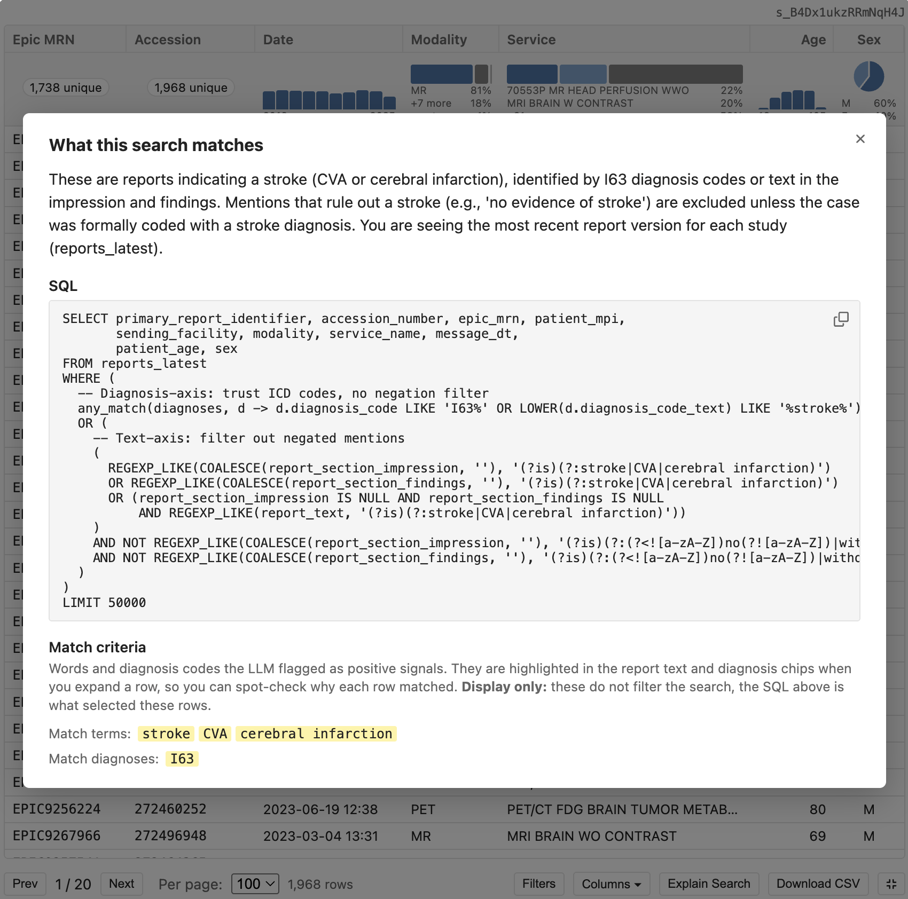
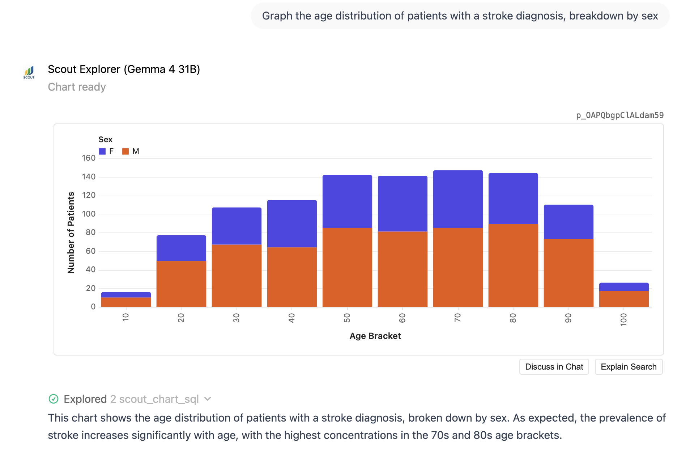

# Chat

Scout Chat provides an AI-powered interface for natural language querying of the Scout data lake. Ask questions in plain English and receive data-driven answers with direct access to your radiology report data.

```{note}
Chat is optional and may not be enabled in all deployments. If you don't see Chat on the Launchpad, contact your administrator.
```



**Current version:** Scout Chat queries HL7 radiology report data. Future versions will support DICOM metadata, pathology reports, and extracted features.

## Overview

Scout Chat is powered by [Open WebUI](https://docs.openwebui.com/) with [Ollama](https://ollama.com/):

- **Natural language SQL**: Converts questions into SQL queries against the data lake
- **Scout Explorer model**: Custom-configured LLM that understands the Scout data schema
- **Data lake access**: Queries Trino through the Scout report-viewer service
- **Interactive results**: Cohort searches render inline as an interactive table
- **Context-aware responses**: Understands Scout terminology, fields, and data structure

## Getting Started

1. Navigate to the [Scout Launchpad](../index.md)
2. Click the **Chat** card
3. Type your question in plain English



4. Press Enter to submit
5. The AI queries the database and provides an answer

## Example Queries

### Research & Cohort Identification

- `How many patients have both a chest CT and a lung nodule diagnosis?`
- `Find all patients with MRI reports mentioning "multiple sclerosis" in the findings`
- `What's the age and sex distribution for patients with pneumonia diagnoses?`
- `List unique patients with both CT and PET scans in 2024`

### Operational & Trend Analysis

- `How does CT volume compare this month vs last month?`
- `What's the average turnaround time by modality?`
- `Show me report volumes by month for the past year`

### Text Search & Exploration

- `Find MRI reports mentioning "metastasis" in the findings section`
- `How many reports contain "incidental" in the impression?`
- `Search for chest X-rays with "opacity" in the findings from the last 6 months`

## Understanding Chat Responses

When you ask a question, Scout Chat:

1. **Interprets** your question in its "Thinking" mode
2. **Calls a tool** to fetch data. Five tools are available:
   - `scout_find_reports` for cohort building.
   - `scout_get_reports` for looking up specific reports.
   - `scout_query_sql` for aggregate analytics like counts, distributions, and groupings.
   - `scout_chart_sql` for turning an aggregate query into a chart.
   - `scout_get_chart_data` for analyzing a chart with the AI.
3. **Analyzes** the returned data and provides a natural language answer

A cohort search (`scout_find_reports`) renders the report viewer, an interactive table above the reply. Aggregate questions are answered in the reply itself, without the viewer.

### Working with Search Results

The report viewer fetches the whole cohort each time you open a chat, which can take a while for a complex query. Once it has loaded, sorting, paging, and filtering all happen in your browser and are fast.



Click a column header to sort. Under each header is a one-line summary of that column across the whole result set, a histogram for ages and dates, a bar for categories like modality, and a pie chart for sex. The bottom toolbar handles paging, column visibility, filtering and other options.

- **Explain Search** shows what the search matched, which table it read, and the SQL.
- **Download CSV** exports your current filters, sort order, and visible columns, not the whole original search.
- **Give the table more room** with the four-arrow icon at the right end of the toolbar. Click it again to shrink back.

### Filtering and Refining

There are two ways to narrow a cohort. **Filters** hides rows from the set already loaded, and clearing them brings the rows back. The column summaries update to match whatever's currently visible. Going through chat instead produces fresh SQL and a **new** saved search, leaving the original intact to compare or return to.

The filter dialog offers age and date ranges, sex, the modalities present in your results, and contains-matches on service, Epic MRN, Patient MPI, accession, and facility. Only fields your search returned appear.



**Apply** filters the rows in front of you. **Filter in Chat** hands the staged filters to the model to run as a new search, and **Discuss in Chat** on an expanded row does the same but for a single report.

Or you can type a follow-up yourself:

```
User: Filter to just CT angiography studies
```

### Reading a Report

Click a row to expand it. You get the report text alongside patient and study metadata, timestamps, diagnosis codes, and the lake path of the source HL7 file. Terms and diagnosis codes the model matched on are highlighted; the highlights are informational, the SQL is what selected the rows.



### Viewing the SQL Query

For cohort searches, click **Explain Search** in the report viewer. The panel describes what the search matched, names the table it read, and shows the SQL.

For other tool calls, expand the tool-call block in the reply.



This is useful for:

- Understanding how the AI interpreted your question
- Learning SQL syntax for use in {ref}`Analytics <analytics>` SQL Lab
- Debugging unexpected results
- Adapting queries for {ref}`Notebooks <notebooks>`

### Creating Charts

Ask for a chart in plain language, for example:

```
Chart report volume by month for 2024
Show me a bar chart of the top 10 diagnosis codes
Plot the age distribution for this cohort
```

The AI writes the SQL and a Vega-Lite chart, which renders inline in the reply. Like a 
cohort search, the chart re-runs its query each time you open it, so it reflects current 
data rather than a snapshot from when it was created.



- **Explain Search** shows the SQL and explanation behind the chart, same as for a
  cohort table.
- **Discuss in Chat** pulls the chart's underlying data back into the conversation so
  you can ask follow-up questions about it.
- Depending on the chart type, you can hover for tooltips, click a legend entry to
  isolate a series, and drag or scroll to pan and zoom. 
- The "..." menu in the corner of the chart lets you export it as an image.

## Tips for Effective Queries

### Be Specific

```
❌ Show me pneumonia cases
✓ How many patients have pneumonia mentioned in the impression, grouped by age decade?
```

### Use Scout Terminology

The AI understands the Scout [data schema](../reference/dataschema.md). Reference field names when relevant:

- **Modality**: CT, MRI, X-ray, US, NM, PET, etc.
- **Report sections**: impression, findings, addendum, technician note
- **Demographics**: age, sex, race, zip code
- **Temporal**: observation date, message date, turnaround time
- **Clinical**: diagnosis codes, service name, study instance UID

### Ask Follow-up Questions

Scout Chat maintains conversation context:

```
User: How many patients have "pulmonary embolism" in the impression?
Chat: There are 1,234 unique patients with pulmonary embolism mentioned.

User: What's the age distribution?
Chat: [Shows breakdown by age group]

User: Filter to just CT angiography studies
Chat: [Shows 892 patients with CTA studies mentioning PE]
```

### Specify Date Ranges

```
How many reports from January 2024 to December 2024?
Show me the number of X-rays in the last 6 months
```

### Request Tabular Data

```
Give me a table of report counts by modality, sorted highest to lowest
List the top 10 diagnosis codes with their counts
```

## Data Privacy and Security

- **Authentication required**: Keycloak authentication (same as other Scout services)
- **Read-only access**: Chat cannot modify or delete data
- **External content blocked**: Scout blocks loading images and resources from external websites
- **Conversation privacy**: Chat history is stored on the server and associated with your user account. Other users cannot see your chats.

```{note}
**Admin visibility**: Scout administrators have the ability to view user chat histories for quality assurance and support. Avoid including sensitive personal information in your conversations.
```

### External Images and Links

Scout Chat includes security protections that block external content. If the AI generates a response containing an image from an external service (such as a charting website), the image will not render.

```{warning}
**Do not click links to external websites in chat responses.**

LLM responses may contain links to third-party services. These links could potentially contain sensitive data from your query embedded in the URL. If you see a broken image or an external link, do not click it.
```

For more advanced visualizations, copy the data to {ref}`Analytics <analytics>` and
build charts there.

## Chat Sharing

```{note}
**Chat sharing is disabled.** Scout has turned off Open WebUI's share-link
feature. Scout users are authorized to see different subsets of the report data,
so a shared conversation could expose results to a recipient who is not
authorized to see them. To
share findings, see whether {ref}`Scout Analytics <analytics>` or
{ref}`Scout Notebooks <notebooks>` fits your need; each applies the viewer's own
data authorization.
```

## Downloading Chats

```{warning}
**Do not download chats containing PHI** unless you have appropriate authorization and secure storage. Downloaded chat files may contain patient identifiers, diagnosis codes, and other sensitive information extracted from query results.
```

Because of these PHI concerns, consider whether {ref}`Scout Analytics <analytics>` or {ref}`Scout Notebooks <notebooks>` would meet your need instead.

## Limitations

### Data Scope

Scout Chat queries data in the Scout data lake only.

**Current version:**
- HL7 radiology report data only
- No PACS image access (DICOM support planned)
- No external database queries

### Query Complexity

For advanced analysis, consider:

- **{ref}`Analytics <analytics>`**: Persistent visualizations, dashboards, and complex SQL
- **{ref}`Notebooks <notebooks>`**: Statistical analysis, machine learning, and custom transformations

### Model Limitations

The AI may occasionally misinterpret questions or generate incorrect queries. Use **Explain Search** in the report viewer or expand the tool-call block to review the SQL and verify it matches your intent.

## Troubleshooting

### Chat Service Not Available

If Chat doesn't appear on the Launchpad, the service may not be enabled in your deployment. Contact your Scout administrator.

### No Response or Errors

1. **Be patient** — GPU resources may be limited with concurrent users
2. **Retry** — Occasionally the model makes formatting errors
3. **Log out and back in** — Refreshes your session
4. **Contact admin** — If issues persist

### Authentication Issues

If Chat rejects you, or the report viewer fails with an authorization error, sign out from inside Scout Chat itself, using your user menu in Open WebUI rather than the Launchpad, and log back in. Chat holds its own session.

### Unexpected Results

1. Click **Explain Search** in the report viewer or expand the tool-call block to review the SQL
2. Verify your question was specific and unambiguous
3. Check if the data contains what you expect
4. Rephrase with more specific criteria

### Tool Not Working

If you see tool errors, contact your administrator.

## Additional Resources

- **[Data Schema](../reference/dataschema.md)**: Available fields and their meanings
- **[Scout interfaces](quickstart.md)**: Analytics, Notebooks, and other Scout services
- **[Tips & Tricks](tips.md)**: General Scout usage tips