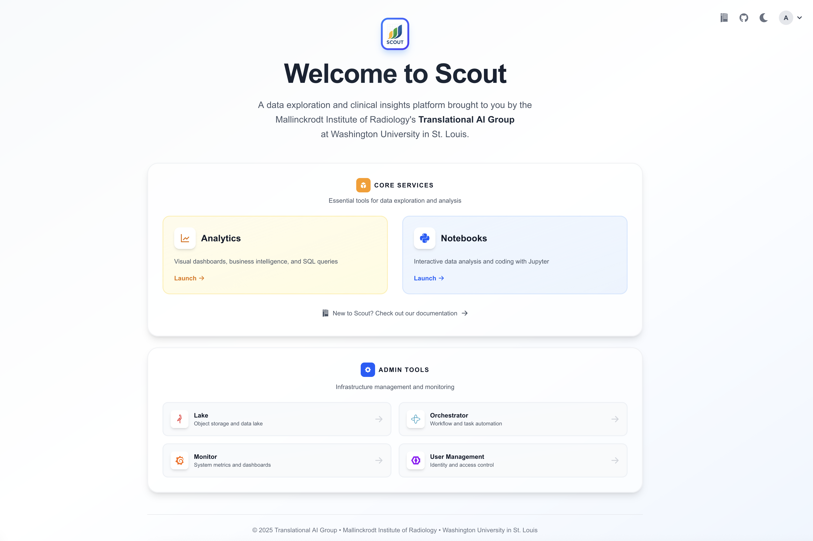
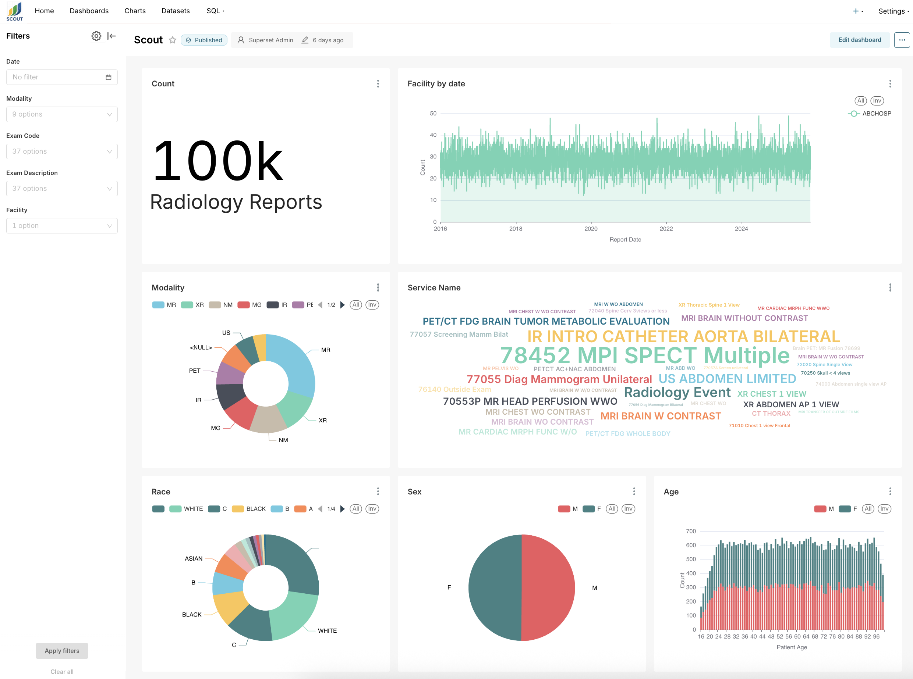
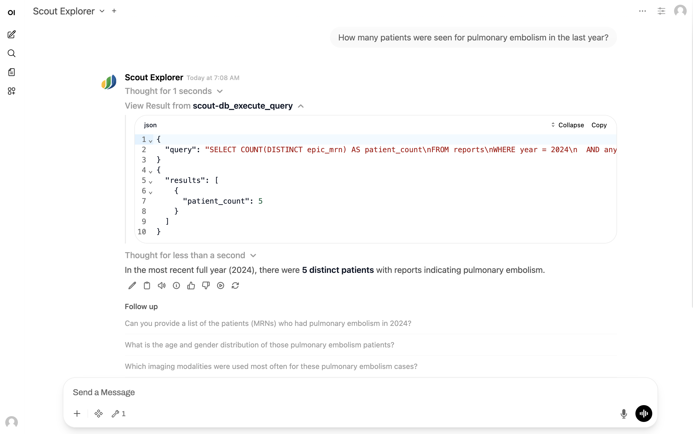
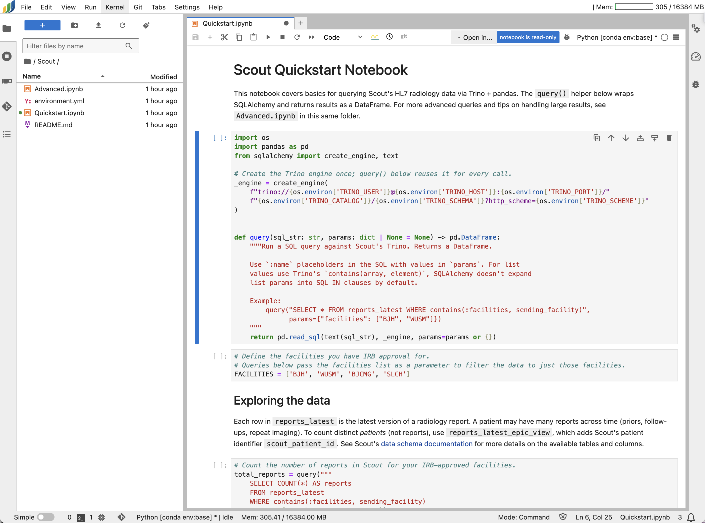

# Quickstart

After [logging in](authentication.md), your landing page is the Scout Launchpad.
From here you can reach all Scout services — Analytics, Notebooks, Chat (if
enabled), and this documentation site.

Scout provides three primary interfaces for working with data, all reachable
from the Launchpad.

(analytics)=
## Analytics

Selecting **Analytics** opens [Apache Superset](https://superset.apache.org/), a
data visualization and exploration tool. Your landing page is the Scout
Dashboard, an overview of all report data. From there you can explore the data
with the no-code [visualization builder](https://superset.apache.org/docs/using-superset/creating-your-first-dashboard)
or run direct queries in [SQL Lab](https://superset.apache.org/docs/using-superset/using-sql-lab/)
(see the [Trino SQL reference](https://trino.io/docs/current/language.html)).

**Key features:**
- Pre-built Scout Dashboard with overview metrics
- Interactive visualizations (charts, tables, pivot tables)
- Direct SQL querying with autocomplete
- Export results to CSV, Excel, and other formats

## Chat

Selecting **Chat** opens an AI-powered interface for natural-language querying of
report data. Ask questions in plain English and get data-driven answers from
large language models with direct access to the Scout Delta Lake; cohort
searches render inline as a sortable, filterable, CSV-exportable table.

**Note:** Chat is optional and may not be enabled in all deployments. See the
[Chat guide](chat.md) for details.

(notebooks)=
## Notebooks

Selecting **Notebooks** launches [JupyterHub](https://jupyterhub.readthedocs.io/)
with a single-user notebook environment that queries the data lake through
[Trino](https://trino.io/), returning results as pandas DataFrames. An example
`Scout/Quickstart.ipynb` notebook ships with sample queries for searching,
filtering, and exporting radiology reports.

**Important:** Notebook servers automatically shut down after a period of
inactivity (default: 2 days) to conserve resources. Files in `/home/jovyan/`
are preserved, but in-memory variables (DataFrames, models, etc.) are lost —
save your work and checkpoint intermediate results. See [Tips & Tricks](tips.md)
for checkpointing strategies.

## Next steps

- [Data Schema](../reference/dataschema.md) — the structure of report data and the HL7 field mappings
- [Tips & Tricks](tips.md) — using Analytics, Chat, and Notebooks effectively
- [Data Authorization](data_authorization.md) — what data you can see once logged in
