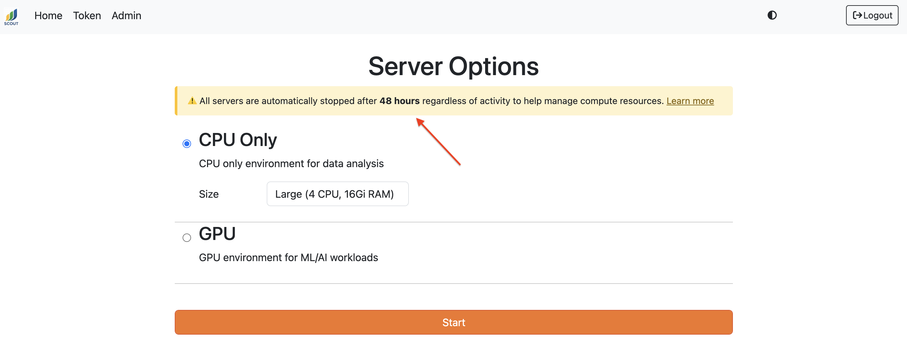

# Tips & Tricks

This page provides helpful tips for using Scout services effectively.

## Analytics (Superset)

### Query Performance

- **Use partitioned columns**: Filter on the `year` column (derived from `message_dt`) for better query performance
- **Limit result sets**: Add `LIMIT` clauses to large queries during exploration
- **Leverage Delta Lake columnar format**: Select only the columns you need rather than `SELECT *`
- **Use SQL Lab for testing**: Test and refine queries in SQL Lab before creating visualizations

### Creating Dashboards

- **Start with the Scout Dashboard**: The pre-built Scout Dashboard provides a good template for creating custom dashboards
- **Use filters**: Add dashboard-level filters to make dashboards more interactive
- **Save queries as datasets**: Complex queries can be saved as virtual datasets for reuse across multiple charts

## Chat

### Getting Better Results

- **Be specific**: Include details like modality, date ranges, or specific fields in your questions
- **Use Scout terminology**: Reference field names from the [data schema](../reference/dataschema.md) for more accurate queries
- **Check the SQL**: Click **Explain Search** in the report viewer to verify the AI generated the correct query
- **Iterate**: Ask follow-up questions to refine results

### When to Use Chat vs. Analytics vs. Notebooks

- **Use Chat for**: Quick exploratory questions, ad-hoc analysis, learning about the data, building and exporting a cohort
- **Use Analytics for**: Creating visualizations, building dashboards, sharing results with others
- **Use Notebooks for**: Complex transformations, statistical analysis, machine learning, custom exports

(notebooks_ref)=
## Notebooks (JupyterHub)

### Query Best Practices

- **Filter early**: Apply `WHERE` clauses as narrowly as possible so Trino's pushdown limits the scan
- **Partition on `year`**: All report tables partition by year — `WHERE year = 2024` prunes whole files, much faster than a `requested_dt` range
- **Use array functions**: Filter array columns with `any_match`:
  ```python
  pd.read_sql("""
      SELECT accession_number, diagnoses
      FROM reports_latest_epic_view
      WHERE any_match(diagnoses, x -> x.diagnosis_code = 'J18.9')
  """, engine)
  ```
- **Leverage convenience columns**: Use `resolved_epic_mrn` (or `resolved_mpi`) on the `_epic_view` views or dynamically-created ID columns instead of parsing `patient_ids` array

### Installing Additional Packages

The base Jupyter environment includes Trino client, pandas, matplotlib, seaborn, scikit-learn, statsmodels, pyarrow, and other core data analysis packages. For ML, NLP, or other specialized libraries, create a conda environment:

```bash
# Create an environment with specific packages
mamba create -n my-env python=3.11 ipykernel pytorch transformers scikit-learn -y

# Or use the sample environment file (in ~/Scout/environment.yml)
mamba env create -f ~/Scout/environment.yml
```

Environments are stored on your persistent home directory (`/home/jovyan/.conda/envs/`) and survive server restarts. The `nb_conda_kernels` extension automatically discovers them as Jupyter kernels -- after creating an environment, refresh the launcher to see it.

```{important}
Every environment you create must include `ipykernel` for `nb_conda_kernels` to discover it as a kernel. Without it, the environment won't appear in the Jupyter launcher.
```

```{note}
In air-gapped deployments, package requests are routed through a proxy transparently -- no extra configuration is needed.
```

### Working with Report Sections

The Delta Lake schema includes parsed report sections:
- `report_section_findings`
- `report_section_impression`
- `report_section_addendum`
- `report_section_technician_note`

Use these for targeted text analysis instead of parsing `report_text`.

### Saving Intermediate Results

Jupyter notebook servers automatically shut down after a configurable period of runtime (2 days by default). You'll see the specific timeout for your deployment displayed in a notification banner when you start your server:



Your notebook files and home directory (`/home/jovyan/`) persist, but in-memory variables are lost. To avoid potentially losing any important work, save notebooks frequently (Ctrl+S / Cmd+S) and save large DataFrames and intermediate results to disk.

**Pandas DataFrames:**
```python
# CSV (human-readable)
df.to_csv('/home/jovyan/checkpoints/results.csv', index=False)
df = pd.read_csv('/home/jovyan/checkpoints/results.csv')

# Parquet (faster, preserves types)
df.to_parquet('/home/jovyan/checkpoints/results.parquet')
df = pd.read_parquet('/home/jovyan/checkpoints/results.parquet')
```

**Python objects (pickle):**
```python
import pickle

# Save any Python object
with open('/home/jovyan/checkpoints/my_data.pkl', 'wb') as f:
    pickle.dump({'results': results, 'config': config}, f)

# Load it back
with open('/home/jovyan/checkpoints/my_data.pkl', 'rb') as f:
    data = pickle.load(f)
```

**ML models:**
```python
# scikit-learn
import joblib
joblib.dump(model, '/home/jovyan/models/classifier.joblib')
model = joblib.load('/home/jovyan/models/classifier.joblib')

# PyTorch
torch.save(model.state_dict(), '/home/jovyan/models/checkpoint.pth')
model.load_state_dict(torch.load('/home/jovyan/models/checkpoint.pth'))
```

## General Tips

### Keyboard Shortcuts

- **Superset SQL Lab**:
  - `Ctrl/Cmd + Enter`: Run query
  - `Ctrl/Cmd + Shift + Enter`: Run selected text

- **JupyterHub**:
  - `Shift + Enter`: Run cell and move to next
  - `Ctrl + Enter`: Run cell and stay
  - `Esc` then `A`: Insert cell above
  - `Esc` then `B`: Insert cell below

### Exporting Data

- **From Analytics**: Click Export in query results (CSV, Excel, etc.)
- **From Chat**: Use **Download CSV** in the report viewer for cohort searches, or take the SQL to Analytics/Notebooks
- **From Notebooks**: Use `df.to_csv()`, `df.to_parquet()`, or other pandas export methods on the result of `pd.read_sql(...)`

### Getting Help

- **Documentation**: Review the [data schema](../reference/dataschema.md), [architecture](../reference/architecture.md), and [ingestion](../operate/ingest.md) docs
- **Issue Tracking**: Report bugs or request features on [GitHub](https://github.com/washu-tag/scout/issues)
- **Admin Tools**: Contact your Scout administrator for access to Monitor, Orchestrator, or User Management interfaces
